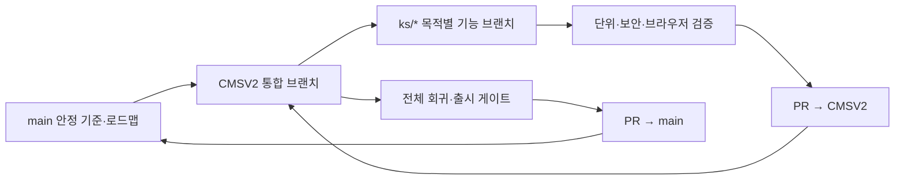
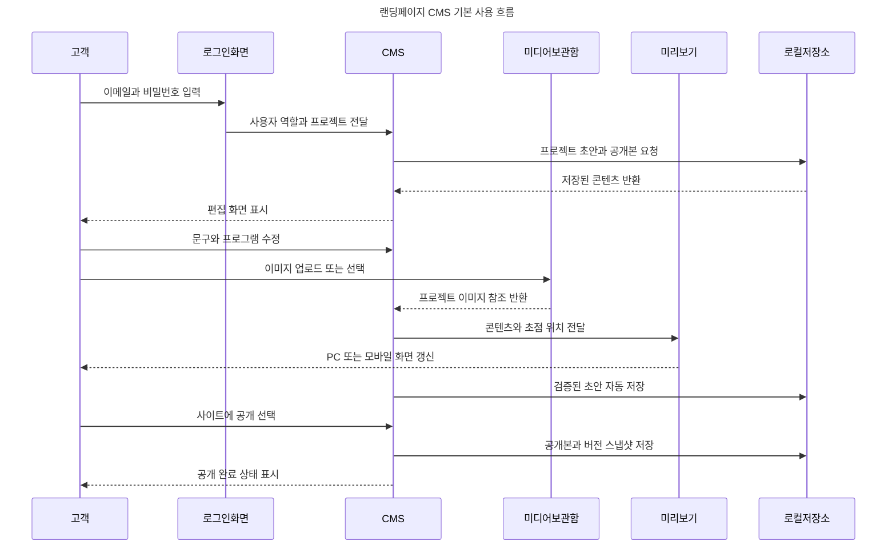
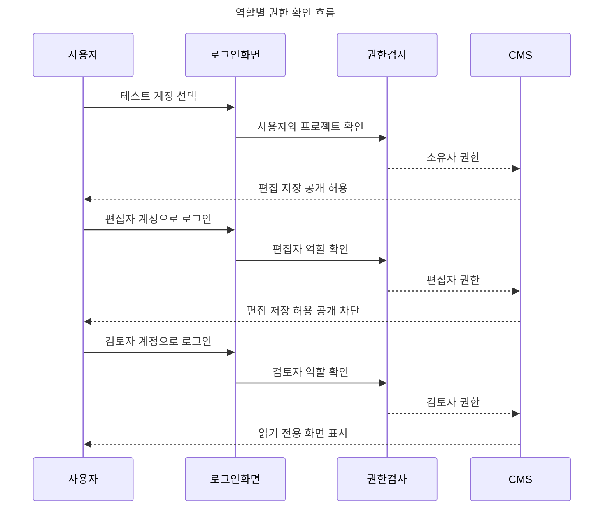

# 온결 첼로 스튜디오 랜딩 페이지

단일 첼로 학원을 위한 React + Vite 반응형 랜딩 페이지입니다. 기존 정적 버전은 `static-index.html`, `app.js`에 보존되어 있습니다.

## 프로젝트 현황판

> 마지막 업데이트: 2026-08-02  
> 현재 단계: **SaaS 플랫폼 0단계 · 아키텍처와 브랜치 책임 분리**
> 현재 실행 모드: **Local MVP** — 고객 운영용 인증·클라우드 저장은 아직 연결되지 않았습니다.

이 프로젝트의 장기 목표는 랜딩페이지 한 개가 아니라 회원·프로젝트·CMS·배포·도메인·구독·운영 기능을 제공하는 웹사이트 빌더 SaaS입니다. 공급자별 비용·장단점·필요 인력·공통 구현 범위와 최종 권장안은 [`docs/PLATFORM_ARCHITECTURE_OPTIONS.md`](docs/PLATFORM_ARCHITECTURE_OPTIONS.md)에서 관리합니다.

### GitHub 저장소와 브랜치 운영 현황

저장소: [kyungsikjeung/cello](https://github.com/kyungsikjeung/cello)

#### 현재 원격 브랜치

| 브랜치 URL | 역할 | 현재 목표 | 병합 조건 | 상태 |
| --- | --- | --- | --- | --- |
| [`main`](https://github.com/kyungsikjeung/cello/tree/main) | 안정 기준선·로드맵 허브 | 검증된 첼로 랜딩페이지와 Local CMS V1, 전체 플랫폼 계획과 브랜치 현황 보존 | 기능 브랜치와 `CMSV2`의 완료 조건 및 회귀 검증 통과 | 안정 |
| [`CMSV2`](https://github.com/kyungsikjeung/cello/tree/CMSV2) | 차세대 통합 브랜치 | 레슨·회사·레스토랑·웨딩 CMS와 플랫폼 기능을 단계적으로 통합 | 카테고리 모델, 템플릿, 데이터 마이그레이션, 보안·브라우저 회귀 테스트 | 개발 중 |

#### 계획된 기능 브랜치와 URL

기능 브랜치는 `CMSV2`에서 분기해 검증 후 다시 `CMSV2`로 병합합니다. 아래 링크는 브랜치 이름과 GitHub URL을 미리 고정한 것으로, 상태가 `생성 전`인 링크는 원격 브랜치를 만든 뒤 활성화됩니다.

| 브랜치 URL | 담당 범위 | 기준·병합 대상 | 핵심 완료 조건 | 상태 |
| --- | --- | --- | --- | --- |
| [`ks/cms-category-templates`](https://github.com/kyungsikjeung/cello/tree/ks/cms-category-templates) | 회사·레스토랑·웨딩·레슨 category/section registry와 공통 Renderer | `CMSV2` → `CMSV2` | 네 업종 생성·편집·1440/768/390px 회귀 검증 | 계획·생성 전 |
| [`ks/platform-auth-projects`](https://github.com/kyungsikjeung/cello/tree/ks/platform-auth-projects) | Supabase Auth, 워크스페이스·프로젝트·구성원, PostgreSQL RLS | `CMSV2` → `CMSV2` | 세 역할 권한과 교차 워크스페이스 차단 테스트 | 계획·생성 전 |
| [`ks/cloud-media`](https://github.com/kyungsikjeung/cello/tree/ks/cloud-media) | MediaStorageProvider, Supabase Storage, R2 전환 경계, 원본·파생 이미지 | `CMSV2` → `CMSV2` | 제한시간 업로드, quota, HEIC, 초점, 삭제·복구 검증 | 계획·생성 전 |
| [`ks/publish-domains`](https://github.com/kyungsikjeung/cello/tree/ks/publish-domains) | 불변 Release, 기본 URL, Preview, 롤백, Vercel/Cloudflare 도메인 | `CMSV2` → `CMSV2` | 원자적 공개·롤백, 소유권·DNS·SSL 상태 검증 | 계획·생성 전 |
| [`ks/billing-observability`](https://github.com/kyungsikjeung/cello/tree/ks/billing-observability) | PortOne/Toss 구독, entitlement, webhook, 감사 로그·알림·복원 | `CMSV2` → `CMSV2` | 중복·순서 역전 webhook, 결제 실패 유예, 백업 복원 검증 | 계획·생성 전 |

#### 브랜치 관리 규칙

- `main`은 실행 가능한 안정 기준선, 전체 로드맵, 아키텍처 결정과 브랜치 현황판을 관리합니다.
- 제품 기능은 `main`에 직접 구현하지 않고 `CMSV2` 또는 목적별 `ks/*` 기능 브랜치에서 개발합니다.
- 목적별 기능 브랜치는 `CMSV2`에서 만들고 Pull Request 검토 후 `CMSV2`로 병합합니다.
- `CMSV2`는 기능 브랜치의 통합·회귀 검증 장소이며 기존 첼로 프로젝트가 계속 정상 작동해야 합니다.
- 여러 책임을 한 브랜치에 섞지 않고 브랜치 하나에는 하나의 완료 조건만 둡니다.
- 기능 브랜치를 생성하거나 병합하면 위 URL 표의 상태와 완료 조건을 같은 변경에서 갱신합니다.
- 기능 구현과 필요한 검증을 모두 통과한 항목만 README 체크박스를 `[x]`로 변경합니다.
- 커밋은 하나의 목적을 가져야 하며 문서, 구현, 검증 결과를 함께 기록합니다.
- 코드 또는 문서가 변경되면 `CHANGELOG/YYYY-MM-DD_HH-mm.md`에 요약·수정 파일·이유·영향·검증 결과를 기록합니다.
- `node_modules`, `dist`, `.env`와 비밀키는 Git에 포함하지 않습니다.
- `CMSV2`가 완료 조건을 충족하면 Pull Request 검토 후 `main`으로 병합합니다.

#### 현재 스냅샷

| 기준 | 커밋 | 내용 |
| --- | --- | --- |
| `main` 문서화 직전 기준 | `1da678c` | 첼로 랜딩페이지, Local CMS, 저장·권한 UX와 기존 브랜치 현황판 |
| `CMSV2` 현재 통합 기준 | `21e5e03` | category registry 기반과 다중 업종 CMS V2 개발 상태 |

#### 개발 흐름



작업을 시작할 때는 현재 브랜치와 작업 트리를 확인하고, 종료할 때는 README 현황·체크박스·검증 결과를 갱신합니다.

### 전체 진행률

| 단계                         | 상태       | 현재 결과                                             | 완료 기준                                     |
| ---------------------------- | ---------- | ----------------------------------------------------- | --------------------------------------------- |
| 0. SaaS 아키텍처·브랜치 분리 | ✅ 완료    | 대안 비용·리소스·권장안과 목적별 브랜치 URL 문서화   | README 현황판과 아키텍처 의사결정 문서        |
| 1. 로그인·권한·프로젝트 격리 | ✅ 완료    | 소유자·편집자·검토자 권한과 프로젝트별 로컬 저장 구현 | 세 역할의 접근 제한 브라우저 검증             |
| 2. 서버 저장·R2              | 🟡 진행 중 | Supabase 스키마, RLS 정책, 환경변수 계약 작성         | 실제 로그인·DB 저장·R2 업로드 통합 테스트     |
| 3. 공개 배포                 | ⚪ 대기    | 로컬 공개본과 버전 스냅샷만 제공                      | 미리보기 URL·운영 URL·롤백 동작               |
| 4. 이미지 처리               | ⚪ 대기    | 브라우저 HEIC→JPEG 변환 제공                          | 서버 WebP/AVIF·썸네일·반응형 변환             |
| 5. 콘텐츠 편집 강화          | ⚪ 대기    | 기본 필드 편집과 미디어 선택 제공                     | 캐러셀/프로그램 추가·삭제·정렬과 공개 점검표  |
| 6. 상담 관리                 | ⚪ 대기    | 상담 폼 UI와 카카오 이동 자리만 제공                  | 문의 저장·상태 관리·개인정보 삭제·카카오 연결 |

상태 표시는 다음 기준을 사용합니다.

- ✅ 완료: 구현과 필요한 검증이 끝난 상태
- 🟡 진행 중: 일부 구현됐지만 완료 기준이 남은 상태
- 🔴 차단: 계정, 결정 또는 외부 시스템이 없어 진행할 수 없는 상태
- ⚪ 대기: 앞 단계 완료 후 진행할 상태

### 이번 작업에서 완료된 내용

- 반응형 02B 랜딩페이지와 스크롤 모션
- 중앙 정렬 무한 루프 캐러셀과 최소 이미지 3장 검증
- PC·모바일 이미지 초점 개별 설정
- IndexedDB 미디어 라이브러리, 원본 보관, HEIC 표시용 변환
- 프로젝트당 250MB·파일당 15MB·최대 100개 제한
- 초안 자동 저장, 공개본 비교, 최대 20개 버전 복원
- 로컬 로그인과 역할별 권한 UI
- 프로젝트 ID 기반 콘텐츠·미디어 격리

### 현재 진행 중인 작업

Local MVP 이후의 서버 연결 기반과 SaaS 브랜치 개발 순서를 준비한 상태입니다.

- `supabase/schema.sql`: 프로젝트·멤버·콘텐츠·버전·미디어 테이블과 RLS 정책
- `docs/CLOUD_MVP.md`: 서버 권한, revision 충돌 방지, R2 객체 규칙
- `docs/PLATFORM_ARCHITECTURE_OPTIONS.md`: 공급자별 비용·장단점·개발 리소스와 단계형 권장 구조
- `.env.example`: Supabase 공개 설정과 서버 전용 R2 설정 구분

### 외부 입력이 필요한 항목

실제 클라우드 통합을 시작하려면 다음 값이 필요합니다. 비밀값은 README나 Git에 기록하지 않습니다.

- Supabase 프로젝트 URL
- Supabase anon key
- Cloudflare Account ID와 R2 버킷 이름
- 서버 환경에 저장할 R2 Access Key ID·Secret Access Key
- 실제 운영 도메인 또는 사용할 임시 배포 도메인

### 다음 작업

1. `ks/platform-auth-projects`를 `CMSV2`에서 생성하고 README 상태를 `개발 중`으로 갱신
2. Supabase 프로젝트 생성 및 환경변수 연결
3. 실제 이메일 로그인으로 로컬 인증 교체
4. 초안·공개본·버전을 PostgreSQL에 저장
5. 세 역할 RLS와 다른 프로젝트 접근 차단 테스트
6. 인증·프로젝트 기반이 병합된 뒤 `ks/cloud-media`와 `ks/publish-domains`를 순서대로 진행

### 최근 검증 결과

| 검증                 | 결과      | 비고                                  |
| -------------------- | --------- | ------------------------------------- |
| `npm run build`      | ✅ 통과   | React/Vite 프로덕션 빌드              |
| 소유자 권한          | ✅ 통과   | 저장·공개 가능                        |
| 편집자 권한          | ✅ 통과   | 저장 가능, 공개 불가                  |
| 검토자 권한          | ✅ 통과   | 저장·공개 불가, 읽기 전용             |
| PNG 업로드·선택·삭제 | ✅ 통과   | IndexedDB 및 실시간 미리보기 확인     |
| 실제 HEIC 파일 변환  | 🟡 미검증 | 변환 코드 포함, 실제 샘플 테스트 필요 |
| Supabase/R2 통합     | ⚪ 미실행 | 접속 정보 연결 후 검증                |

### 문서 역할

- `README.md`: 현재 진행 상태, 실행법, 검증 결과, 다음 작업을 확인하는 첫 문서
- `docs/PLATFORM_ARCHITECTURE_OPTIONS.md`: 대안 아키텍처, 비용·인력 비교, 권장 공급자 조합과 전환 기준
- `docs/CLOUD_MVP.md`: 서버 구현 시 지켜야 할 데이터·권한·스토리지 계약
- `supabase/schema.sql`: 실제 DB 테이블과 접근 정책
- `.env.example`: 필요한 환경변수 이름과 공개/비공개 경계
- `CHANGELOG/`: 변경 이유·영향과 검증 결과의 시간순 기록

앞으로 기능을 변경할 때는 이 현황판의 **마지막 업데이트, 단계 상태, 최근 검증 결과, 다음 작업**도 함께 갱신합니다.

## 실행

Node.js가 설치된 환경에서 실행합니다.

```powershell
npm install
npm run dev
```

배포용 파일은 `npm run build`로 생성하며 결과물은 `dist` 폴더에 저장됩니다.

관리자 CMS는 개발 서버 실행 후 아래 주소에서 확인합니다.

```text
http://127.0.0.1:4318/admin.html
```

## 앱 사용 흐름

현재 Local MVP에서 고객이 로그인한 뒤 콘텐츠를 수정하고 공개본을 만드는 기본 흐름입니다.



역할별로 같은 화면에서 가능한 작업이 달라집니다.



### 처음 사용하는 방법

1. `npm run dev`를 실행합니다.
2. 브라우저에서 `http://127.0.0.1:4318/admin.html`을 엽니다.
3. 테스트 계정을 선택하고 `작업공간 열기`를 누릅니다.
4. 왼쪽 메뉴에서 첫 화면, 프로그램, 강사, 위치, 디자인을 수정합니다.
5. 미디어 메뉴에서 이미지를 업로드하고 사용할 영역에 연결합니다.
6. 오른쪽 미리보기에서 Desktop, Tablet, Mobile 화면을 확인합니다.
7. 상단의 `지금 저장`으로 초안을 저장합니다.
8. 소유자 계정은 `변경 비교` 후 `사이트에 공개`할 수 있습니다.
9. 문제가 생기면 버전 메뉴에서 이전 공개본을 초안으로 복원합니다.

이 다이어그램은 현재 로컬 MVP를 기준으로 합니다. Supabase와 R2가 연결되면 `로그인화면 → 권한검사`, `CMS → 로컬저장소`, `미디어보관함 → 로컬저장소` 구간이 각각 실제 인증 서버, PostgreSQL, R2 API 호출로 교체됩니다.

현재 CMS MVP는 브라우저 `localStorage`에 초안과 공개본을 분리해 저장합니다. JSON 불러오기·내보내기를 지원하므로 고객 프로젝트를 파일로 백업하거나 복제할 수 있습니다. 클라우드 운영 단계에서는 동일한 스키마를 PostgreSQL과 이미지 스토리지로 이전합니다.

### 로그인 및 역할 MVP

`admin.html`은 로컬 로그인 화면을 먼저 표시합니다. 테스트 비밀번호는 모두 `demo1234`이며 실제 고객 정보나 운영 비밀번호를 사용하면 안 됩니다.

- `owner@ongyeol.local`: 초안 편집·저장·공개 가능
- `editor@ongyeol.local`: 초안 편집·저장 가능, 공개 불가
- `viewer@ongyeol.local`: 읽기 전용

세션은 브라우저 탭의 `sessionStorage`에만 유지됩니다. 현재 구현은 권한 UX를 검증하기 위한 로컬 MVP이며 운영 인증이 아닙니다. 서버 전환 스키마와 보안 계약은 `supabase/schema.sql`, `docs/CLOUD_MVP.md`, `.env.example`에 정리되어 있습니다.

### CMS 저장 키

```text
landing-cms:draft:ongyeol-cello
landing-cms:published:ongyeol-cello
landing-cms:versions:ongyeol-cello
```

- 초안 저장: 편집 중인 검증된 데이터를 저장합니다.
- 공개본 생성: 초안과 별도로 공개 스냅샷을 생성합니다.
- 기본값 복원: `default-site.js`의 초기 콘텐츠로 되돌립니다.
- JSON 내보내기: 프로젝트 전체 콘텐츠를 파일로 백업합니다.
- JSON 불러오기: Zod 검증을 통과한 프로젝트만 편집기에 반영합니다.

### 저장 안전성과 버전 관리

- 입력 변경 후 0.9초 동안 추가 입력이 없으면 자동으로 초안을 저장합니다.
- 저장 전에는 상단에 주황색 점과 `변경사항 있음` 상태를 표시합니다.
- 유효하지 않은 데이터는 자동 저장과 공개를 중단합니다.
- 공개 전 초안과 현재 공개본의 변경 필드를 나란히 비교합니다.
- 공개할 때마다 `v001`, `v002` 형식의 변경 불가능한 스냅샷을 생성합니다.
- 버전 화면에서 이전 공개본을 현재 초안으로 복원할 수 있습니다.
- 기본값 복원은 확인 모달을 통과해야 실행됩니다.
- 브라우저를 닫을 때 저장되지 않은 변경이 있으면 이탈 경고를 표시합니다.

## 다른 프로젝트로 가져오기

- `src/App.jsx`: 페이지 UI와 React 상태·스크롤 모션
- `styles.css`: 디자인 토큰, 반응형 레이아웃, 애니메이션
- `assets`: 레슨 이미지

세 항목을 대상 React 프로젝트에 복사하면 됩니다. Next.js에서는 이미지 경로를 `/public/assets` 기준으로 유지하고 `App.jsx`를 페이지 컴포넌트로 분리하세요.

## 카카오톡 채널 연결

1. Kakao Developers에서 앱을 만들고 웹 플랫폼 도메인을 등록합니다.
2. 학원의 카카오톡 채널을 앱에 연결합니다.
3. React 버전에서는 환경변수와 별도 상담 컴포넌트로 SDK 초기화 코드를 연결합니다. 기존 연결 예시는 `app.js`에 보존되어 있습니다.
4. 문의 폼은 내용을 클립보드에 복사한 뒤 채널 1:1 채팅을 엽니다. SDK 정책상 채팅 입력창에 내용을 자동 삽입하거나 전송하지 않습니다.

학원명, 원장 이력, 주소, 연락처는 현재 교체용 예시입니다. 실제 공개 전 개인정보처리방침과 수집·보유 기간, 사업자 정보를 확정해야 합니다.

## 디자인 플레이북

이 프로젝트의 시각 방향은 `Editorial Image Carousel`입니다. 한 학원만을 위한 집중도 높은 랜딩페이지이므로 많은 기능을 나열하기보다 큰 타이포그래피, 실제 학습 장면, 짧은 문장과 명확한 상담 동선을 사용합니다.

### 디자인 토큰

- 배경: `#FFFFFF`
- 본문·컨트롤: `#111111`
- 핵심 액센트: `#275DFF`
- 이미지 영역 보조 배경: `#E9ECF5`
- 큰 영문 제목은 굵고 좁은 행간, 음수 자간을 사용합니다.
- 본문 모션은 절제하고 제목·사진·현재 상태에만 강한 대비를 사용합니다.
- 사진은 흑백을 기본으로 하되 활성 사진과 파란색 상태 표시로 시선을 유도합니다.

### 첫 화면 구성 원칙

첫 화면은 왼쪽의 메시지와 오른쪽의 학습 장면으로 나눕니다.

1. 작은 카테고리 라벨
2. 세 줄의 강한 브랜드 문장
3. 두 줄 이하의 설명
4. 단일 주요 CTA
5. 가운데 사진이 강조된 이미지 캐러셀

메인 문구는 `SEE THE / SOUND / TAKE SHAPE.`처럼 줄마다 의미가 완성되도록 작성합니다. 설명은 `한 번의 레슨, 한 번의 발견.`처럼 짧은 선언 뒤 구체적인 가치 문장을 배치합니다.

### Centered Infinite Loop Carousel

원형으로 회전하는 3D 링이 아니라 중앙 활성 카드와 양옆 일부가 보이는 `Centered Infinite Loop Carousel`을 사용합니다.

- 중앙 이미지는 크고 선명하게 표시합니다.
- 이전·다음 이미지는 `Side Peek` 형태로 일부만 노출합니다.
- 비활성 이미지는 축소하고 투명도를 낮춥니다.
- 활성 이미지에만 캡션을 표시합니다.
- 자동재생, 화살표, 마우스 드래그와 터치 스와이프를 함께 지원합니다.
- 마지막에서 첫 번째로 이동할 때 반대 방향으로 되돌아가지 않습니다.

React 구현은 원본 배열을 세 번 이어 붙인 순환 버퍼를 사용합니다.

```text
[이전 세트] [현재 세트] [다음 세트]
                 ↑ cursor
```

커서가 외부 세트에 도달하면 transition을 잠시 해제하고 동일한 이미지가 있는 가운데 세트로 이동합니다. 화면의 이미지가 같기 때문에 사용자는 재배치를 인식하지 못합니다. 화면에 표시할 실제 인덱스는 `cursor % slides.length`로 계산합니다.

### 첫 진입 텍스트 모션

제목에는 `Line Mask Reveal + Stagger`를 적용합니다.

```text
0.15s  SEE THE
0.27s  SOUND
0.39s  TAKE SHAPE.
0.72s  설명 문장
0.90s  CTA
```

각 제목 줄은 마스크 아래의 `translateY(110%)` 상태에서 올라오며 약한 회전을 함께 제거합니다. 한 글자씩 분리하지 않고 줄 단위로 움직여 편집 디자인의 힘과 가독성을 유지합니다. 설명은 18px 이내의 부드러운 Fade-up을 사용합니다.

### 0~100vh 스크롤 시퀀스

스크롤 위치를 viewport 높이로 나눈 연속 진행률을 CSS 변수로 전달합니다. 스크롤마다 React 렌더링을 만들지 않고 `requestAnimationFrame` 안에서 루트 CSS 변수만 갱신합니다.

| 스크롤 구간 | 표현                                        |
| ----------- | ------------------------------------------- |
| 0~15vh      | 제목과 설명을 읽을 수 있도록 거의 정지      |
| 15~40vh     | 제목 세 줄이 서로 다른 거리로 왼쪽 이동     |
| 40~65vh     | 설명·버튼·드래그 안내가 순서대로 퇴장       |
| 65~85vh     | 캐러셀이 확대되고 화면의 시각 중심이 됨     |
| 85~100vh    | 제목이 사라지고 다음 프로그램 섹션으로 연결 |

사용하는 CSS 변수는 다음과 같습니다.

- `--hero-scroll`: 첫 viewport 전체 진행률
- `--title-exit`: 제목 분리와 퇴장 진행률
- `--copy-exit`: 설명과 CTA 퇴장 진행률
- `--image-focus`: 캐러셀 확대 진행률
- `--hero-handoff`: 다음 섹션 연결 진행률

### 하위 섹션 모션 언어

- 프로그램: 스크롤 위치에 따라 과정과 파란색 상태 점을 변경합니다.
- 강사 사진: 파란 커버가 옆으로 걷히는 Image Reveal을 사용합니다.
- 지도: 선이 그려진 뒤 위치 마커가 2회만 펄스합니다.
- 상담 폼: 필드를 위에서 아래 순서로 Fade-up합니다.
- 본문과 작은 정보 카드에는 12~24px 이내의 이동만 사용합니다.

한 화면에서 모든 요소를 동시에 움직이지 않습니다. `라벨 → 제목 → 설명 → 이미지/CTA` 순서를 유지해야 시선이 자연스럽게 이동합니다.

### 반응형·접근성 원칙

- 데스크톱은 텍스트와 이미지의 분할 레이아웃을 사용합니다.
- 모바일에서는 콘텐츠를 세로로 재배치하고 이동 거리와 확대율을 절반 이하로 줄입니다.
- 모바일에서는 캐러셀이 화면을 가로로 확장하는 효과를 사용하지 않습니다.
- `prefers-reduced-motion: reduce`에서는 스크롤 패럴랙스·확대·펄스를 제거합니다.
- 모션을 제거해도 모든 콘텐츠와 활성 이미지가 즉시 보여야 합니다.
- 애니메이션은 `transform`과 `opacity` 중심으로 구현해 레이아웃 재계산을 줄입니다.

### 상담과 카카오톡 연결 원칙

카카오 JavaScript SDK로 학원 채널의 1:1 채팅을 열 수 있지만, 웹페이지가 사용자의 개인 카카오톡 대화 내용을 실시간으로 읽거나 개인 프로필 채팅에 자동 답변하는 구조는 아닙니다. 문의 폼 내용을 클립보드에 복사한 뒤 채널 채팅을 열고 사용자가 직접 붙여넣도록 안내합니다. 실제 자동상담이 필요하면 카카오톡 채널 챗봇 또는 상담톡 등 별도 비즈니스 기능과 서버 구성이 필요합니다.

### 다음 프로젝트에서 유지할 감각

- 한 브랜드의 핵심 메시지를 첫 화면에 하나만 둡니다.
- 사진은 장식이 아니라 수업 방식과 결과를 보여주는 증거로 사용합니다.
- 화려한 모션보다 시선의 순서와 정보의 위계를 우선합니다.
- 자동재생은 사용자의 드래그·버튼 조작과 충돌하지 않게 잠시 정지하는 것이 좋습니다.
- 디자인 시안의 색상, 간격, 글자 크기를 토큰으로 정의한 뒤 반응형에서도 같은 비율과 대비를 유지합니다.
- 빌드 성공과 실제 브라우저·카카오 연동·배포 완료를 서로 구분해서 검증합니다.

## 이미지 업로드 및 미디어 라이브러리 MVP

- 저장소: 브라우저 IndexedDB (`landing-cms-media`), 외부 R2/서버 업로드는 이번 범위에서 제외
- 권한: 고객도 관리자 화면에서 직접 업로드 가능(로컬 MVP이므로 계정·역할 권한은 후속 서버 단계에서 적용)
- 지원 형식: JPG, PNG, WebP, HEIC/HEIF
- HEIC 정책: 원본을 보관하고, 브라우저 표시용 JPEG(품질 0.88)를 별도로 생성
- 제한: 프로젝트당 250MB, 파일당 15MB, 최대 100개. 브라우저 실제 잔여 용량이 부족하면 더 일찍 차단
- 캐러셀: 사이트 스키마에서 최소 3장, 최대 12장을 유지
- 초점: PC/모바일을 각각 X·Y 10~90% 범위에서 설정하며 실제 `object-position`에 반영
- 삭제 안전장치: 페이지에서 사용 중인 미디어는 먼저 교체하기 전까지 삭제 불가
- 원본 보관: 업로드 원본 Blob을 유지하며 HEIC만 표시용 파생본을 함께 저장

이 MVP의 IndexedDB 데이터는 업로드한 해당 브라우저·기기에만 존재합니다. 여러 고객 계정, 장치 간 동기화, 운영 배포, CDN 전송이 필요해지는 단계에서 인증과 오브젝트 스토리지(R2 등)로 이전해야 합니다.
