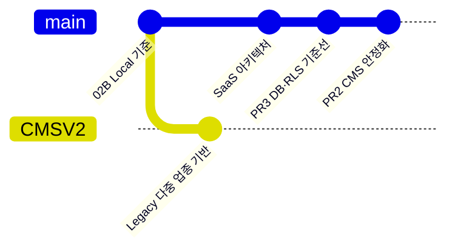
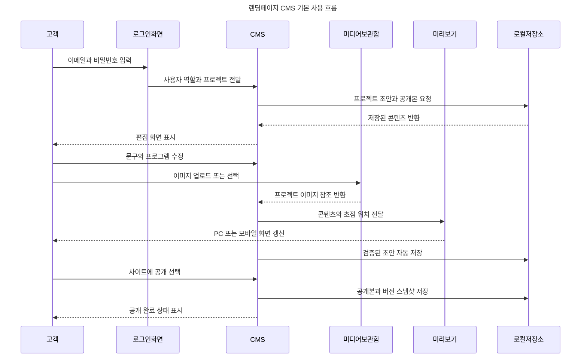
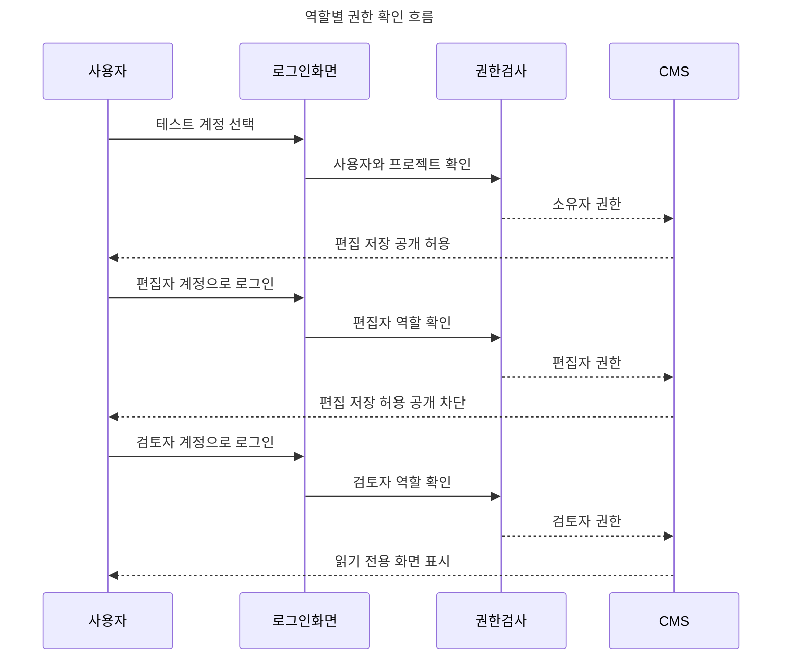

# 다중 업종 웹사이트 빌더 SaaS

레슨·회사·레스토랑·웨딩 사이트를 하나의 CMS에서 제작하고, 콘텐츠 편집부터 미디어·배포·도메인·구독·운영까지 연결하는 멀티테넌트 웹사이트 제작 플랫폼입니다.

> **`온결 첼로 스튜디오`는 제품명이 아닙니다.** `editorial-02b` 템플릿, 반응형 랜딩페이지, CMS 편집과 공개 흐름을 검증한 첫 번째 레퍼런스 프로젝트입니다. 기존 디자인과 동작은 회귀 기준으로 유지하지만 최종 개발 범위는 범용 SaaS입니다.

> 마지막 업데이트: 2026-08-02
>
> 현재 단계: **Local CMS 안정화 · 자체 Fastify/PostgreSQL 백엔드 기반·실제 DB 통합 검증 · React 연결 준비**
>
> 운영 가능 여부: **아직 불가** — 실제 고객 인증·클라우드 저장·공개 URL·도메인·결제는 연결되지 않았습니다.

## 프로젝트 배경

소규모 사업자의 사이트를 프로젝트마다 새로 만들면 비슷한 화면과 기능을 반복 구현하게 되고, 문구나 이미지 같은 일상적인 수정도 개발자에게 의존하게 됩니다. 인증, 파일 저장, 배포, 도메인과 결제까지 서로 다른 서비스에 흩어지면 고객별 데이터 격리와 장애 복구도 일관되게 관리하기 어렵습니다.

이 프로젝트는 이미 검증한 첼로 02B 화면을 버리는 대신, 업종 차이를 `category`, `template`, `section schema`로 정의하고 공통 CMS와 렌더러 위에서 재사용하는 방향으로 확장합니다. 고객은 자신의 프로젝트를 직접 운영하고, 플랫폼 운영자는 같은 구조로 여러 업종과 고객을 안전하게 관리하는 것이 핵심입니다.

| 해결하려는 문제 | 플랫폼이 제공할 방식 |
| --- | --- |
| 업종·고객마다 코드가 복제됨 | 카테고리·템플릿·섹션 스키마와 공통 Renderer 사용 |
| 간단한 콘텐츠 수정도 개발자가 필요함 | 권한이 있는 고객이 CMS에서 직접 편집·미리보기·공개 |
| 콘텐츠·미디어·도메인·결제가 분산됨 | 프로젝트 생애주기를 하나의 관리 화면과 상태 모델로 연결 |
| 잘못된 공개나 고객 간 데이터 노출 위험 | 프로젝트 격리, 불변 Release, 감사 기록과 롤백 제공 |

## 구현 목표

### 1차 상용 MVP

1. 회원가입 후 워크스페이스와 프로젝트를 생성합니다.
2. 지원되는 템플릿으로 문구·섹션·이미지를 편집하고 PC·태블릿·모바일 화면을 확인합니다.
3. 고객 데이터와 미디어를 서버에서 프로젝트별로 격리합니다.
4. 검증된 초안을 기본 URL에 공개하고 이전 공개본으로 복원합니다.

### 후속 확장 목표

1. 레슨·회사·레스토랑·웨딩 템플릿과 섹션 편집기를 확장합니다.
2. 고객 소유 도메인을 연결하고 DNS·SSL 상태를 관리합니다.
3. 요금제 구독과 사용 권한·용량 제한을 연결합니다.
4. 공개·권한·결제 감사 기록, 모니터링과 백업 복구를 제공합니다.

제품이 완성됐다고 판단하는 기준은 화면 수가 아니라 다음 결과입니다.

- 업종을 추가할 때 기존 화면을 복제하지 않고 스키마와 섹션 조합으로 확장할 수 있어야 합니다.
- 고객은 자신의 프로젝트만 볼 수 있고 서버가 모든 권한을 다시 검증해야 합니다.
- 편집 화면과 공개 사이트는 같은 렌더링 컴포넌트를 사용해야 합니다.
- 공개 실패가 기존 운영 사이트를 깨뜨리지 않고 모든 공개본을 즉시 롤백할 수 있어야 합니다.
- 공급자를 바꾸더라도 CMS 데이터와 렌더러를 전면 재작성하지 않도록 서비스 경계를 유지해야 합니다.

## 현재 구현 범위와 전체 진행률

| 영역 | 현재 `main`에서 확인 가능한 범위 | 상용 목표 | 상태 |
| --- | --- | --- | --- |
| 레퍼런스 렌더러 | 첼로 `editorial-02b` 반응형 화면·모션·무한 캐러셀 | 네 업종의 재사용 가능한 템플릿·섹션 | 🟡 Local 구현 |
| CMS 편집 | 문구·프로그램·디자인·미디어 편집과 반응형 미리보기 | 카테고리별 섹션 추가·삭제·정렬 | 🟡 Local 구현 |
| 인증·프로젝트 | Better Auth/Fastify, 분리 DB 역할, workspace/project API와 실제 RLS 격리 테스트 | React 로그인·프로젝트 선택 연결 | 🟡 서버 기반 검증·앱 미연결 |
| 콘텐츠·버전 | Local 버전 UX와 revision 저장·불변 Release·공개·롤백 RPC | CMS를 PostgreSQL 저장 경로에 연결 | 🟡 DB 계약 완료·앱 미연결 |
| 미디어 | IndexedDB 원본 보관·HEIC 표시본·PC/모바일 초점·용량 제한 | 클라우드 원본·파생본·CDN·복구 | 🟡 Local 전용 |
| 공개·도메인 | 브라우저 안에서 공개 스냅샷 생성 | 기본 URL·Preview·롤백·고객 도메인·DNS·SSL | ⚪ 미구현 |
| 결제·운영 | 요구사항과 대안 아키텍처 문서 | 구독·Entitlement·감사 로그·알림·백업 복원 | ⚪ 미구현 |
| 상담 연동 | 문의 폼과 카카오톡 채널 이동 자리 | 문의 저장·상태 관리·비즈니스 상담 연동 | ⚪ 미구현 |

현재 실행 가능한 화면은 한 브라우저 안의 단일 `ongyeol-cello` 프로젝트를 검증하는 Local MVP입니다. 서버 쪽 프로젝트 격리·revision·불변 Release·공개·롤백 계약은 migration과 47개 DB 테스트로 검증했지만, CMS는 아직 `localStorage`와 IndexedDB를 사용하므로 운영 멀티테넌트 서비스가 완성된 것은 아닙니다. 기존 `CMSV2`는 오래된 `main`에서 갈라진 보존 브랜치이며 직접 병합하지 않습니다. 다중 업종 변경은 최신 `main`에서 새 브랜치를 만든 뒤 필요한 커밋만 이식합니다.

## 자체 호스팅 Local-first 아키텍처

현재 React + Vite 구현은 CMS·렌더러·02B 디자인 회귀 기준선으로 유지합니다. 클라우드 비용은 실제 사용자가 생길 때까지 미루되, 로컬과 운영의 데이터 계약은 같게 가져갑니다.

| 단계 | 구성 | 비용 계획값 | 허용 범위 |
| --- | --- | ---: | --- |
| 현재 | Local CMS + Fastify + Better Auth + PostgreSQL SQL 기반 | $0 | UI와 자체 백엔드 데이터·권한 계약 검증 |
| 다음 MVP | 실제 PostgreSQL migration·Auth·workspace/project 앱 연결 | $0 | 실제 회원과 프로젝트 단위 통합 |
| 비공개 베타 | 소형 VM의 API/PostgreSQL + Cloudflare 정적 자산 | 서버 선택에 따라 발생 | 초대 사용자와 백업·복원 검증 |
| 첫 유료 고객 | 관리형 또는 자체 PostgreSQL·객체 저장소·모니터링 | 사용량·운영 방식에 따라 발생 | 출시 게이트 통과 후 상용 운영 |

- 로컬에서 SQL migration, API와 `dist`를 검증한 뒤 같은 버전을 서버와 Cloudflare에 승격합니다.
- Vercel은 SEO·Next.js·Preview 자동화 가치가 비용보다 커질 때 Pro 유료 대안으로 사용합니다. Hobby는 개인·비상업용이므로 상용 무료안으로 계산하지 않습니다.
- 초기 미디어는 개발용 Local StorageProvider로 시작하고 운영에서는 R2/S3 호환 객체 저장소로 교체합니다.
- 고객 도메인, 결제와 유료 모니터링은 기본 URL·공개·롤백이 검증된 뒤 추가합니다.
- 개인 PC의 로컬 API·PostgreSQL을 인터넷이나 터널로 공개해 운영 서버로 사용하지 않습니다.

새 기준은 [`docs/SELF_HOSTED_BACKEND.md`](docs/SELF_HOSTED_BACKEND.md), 이전 관리형 대안과 비용 비교는 [`docs/LOCAL_FIRST_BACKEND.md`](docs/LOCAL_FIRST_BACKEND.md), [`docs/PLATFORM_ARCHITECTURE_OPTIONS.md`](docs/PLATFORM_ARCHITECTURE_OPTIONS.md)에 보존합니다.

## GitHub 브랜치 현황

저장소: [kyungsikjeung/cello](https://github.com/kyungsikjeung/cello)



PR #2와 PR #3은 `main`에 병합됐습니다. 기존 `CMSV2`에는 최신 CI·Supabase migration·Vitest 기준선이 없으므로 직접 병합하면 해당 파일이 삭제될 수 있습니다. 카테고리 확장은 최신 `main`에서 다시 분기합니다. `계획·생성 전` 브랜치 URL은 원격 브랜치를 만든 뒤 열립니다.

| 브랜치 URL | 역할 | 핵심 목표 | 상태 |
| --- | --- | --- | --- |
| [`main`](https://github.com/kyungsikjeung/cello/tree/main) | 안정 기준 | CMS 안정화와 DB/RLS 검증본 유지 | PR #2·#3 병합·CI 통과 |
| [`ks/cms-stability-tests`](https://github.com/kyungsikjeung/cello/tree/ks/cms-stability-tests) | CMS 안정화 | 복원 방어·미디어 회귀·Vitest·반응형 CI | 완료·PR #2 병합 |
| [`ks/platform-auth-projects`](https://github.com/kyungsikjeung/cello/tree/ks/platform-auth-projects) | 플랫폼 DB | 프로젝트 RLS·revision·불변 Release·공개/롤백 RPC | 완료·PR #3 병합 |
| [`CMSV2`](https://github.com/kyungsikjeung/cello/tree/CMSV2) | Legacy 보존 | 기존 다중 업종 registry 참고 | 직접 병합 금지 |
| `ks/platform-workspace-auth` | 관리형 Auth 계획 | 기존 Supabase 연결안 | 자체 백엔드 결정으로 대체·생성 안 함 |
| `ks/custom-baas-foundation` | 자체 백엔드 | Fastify·Better Auth·PostgreSQL·workspace/project API | Local 작업 중·미푸시 |
| [`ks/cms-category-templates`](https://github.com/kyungsikjeung/cello/tree/ks/cms-category-templates) | 업종 템플릿 | 최신 `main`에서 Legacy 카테고리 변경을 선별 이식 | 계획·재분기 필요 |
| [`ks/cloud-media`](https://github.com/kyungsikjeung/cello/tree/ks/cloud-media) | 미디어 | 클라우드 업로드·원본·파생본 관리 | 계획·생성 전 |
| [`ks/publish-domains`](https://github.com/kyungsikjeung/cello/tree/ks/publish-domains) | 배포·도메인 | 미리보기·공개·롤백·DNS 연결 | 계획·생성 전 |
| [`ks/billing-observability`](https://github.com/kyungsikjeung/cello/tree/ks/billing-observability) | 결제·운영 | 구독·권한·로그·알림·복구 구축 | 계획·생성 전 |

## 협업자 시작 가이드

### 처음 30분에 확인할 것

1. [`AGENTS.md`](AGENTS.md)에서 회귀 방지, 프로젝트 격리, 미디어와 공개 원칙을 읽습니다.
2. 아래 실행법으로 랜딩페이지와 관리자 CMS를 직접 엽니다.
3. `owner`, `editor`, `viewer(검토자)`의 Local 권한 차이를 확인합니다.
4. 위 브랜치 표에서 담당 영역과 현재 상태를 확인합니다.
5. 백엔드 작업은 [`docs/SELF_HOSTED_BACKEND.md`](docs/SELF_HOSTED_BACKEND.md)의 API·DB 보안 경계와 [`docs/CLOUD_MVP.md`](docs/CLOUD_MVP.md)의 데이터·권한 계약을 먼저 확인합니다.

### 소스 지도

| 경로 | 책임과 협업 시 주의점 |
| --- | --- |
| `src/App.jsx` | 랜딩페이지 렌더러와 모션. CMS 미리보기와 공개 화면이 함께 사용합니다. |
| `src/data/site-schema.js` | 콘텐츠 검증 계약. 현재 `editorial-02b` 한 개만 허용하므로 업종 확장 시 핵심 변경점입니다. |
| `src/data/default-site.js` | 온결 첼로 레퍼런스 데이터. 제품 공통값으로 간주하지 않습니다. |
| `src/cms/CmsAppV2.jsx` | CMS 편집·검증·초안·공개·버전 UX의 현재 기준선입니다. |
| `src/cms/auth.js` | Local 데모 인증과 권한. 운영 인증으로 사용하지 않고 자체 `/api/auth/*` 세션으로 교체합니다. |
| `src/cms/media-db.js` | IndexedDB 미디어 저장과 제한. 클라우드 전환 시 동일한 정책을 서버에서도 검증합니다. |
| `supabase/migrations/20260802120000_init.sql` | 자체 백엔드 전환 전에 검증한 Supabase DB 기준선입니다. 신규 migration의 실행 경로가 아닙니다. |
| `supabase/tests/database/platform_rls.test.sql` | 기존 47개 pgTAP 시나리오를 보존한 전환 참고 테스트입니다. |
| `server/` | Fastify 실행 진입점과 Auth·DB·HTTP route·관리 스크립트를 책임별 폴더로 분리한 자체 백엔드입니다. |
| `server/README.md` | 백엔드 파일 구조, 시작 순서, 실행 명령과 파일 배치 기준입니다. |
| `db/migrations/` | 공급자 중립 PostgreSQL 인증·workspace·project·RLS의 새 migration 기준선입니다. |
| `tests/backend/` | 백엔드 단위 테스트와 실제 PostgreSQL 통합 테스트를 분리해 관리합니다. |
| `docs/SELF_HOSTED_BACKEND.md` | 자체 호스팅 백엔드 결정, 보안 경계, 실행·배포와 MVP 순서입니다. |
| `docs/LOCAL_FIRST_BACKEND.md` | 이전 관리형 Supabase 대안과 비용 판단 기록입니다. |
| `docs/CLOUD_MVP.md` | 전환 전 Local-to-Cloud 데이터·권한 요구사항 참고 문서입니다. |

### 현재 최우선 구현

- [x] CMS 안정화 변경과 Supabase DB/RLS 기준선을 목적별 PR로 `main`에 병합
- [x] Supabase CLI·`config.toml`·migration·seed와 47개 DB 테스트 구성
- [x] `owner`, `editor`, `reviewer`의 교차 프로젝트 RLS와 공개·롤백 경계 검증
- [x] 병합 후 `main`의 31개 단위 테스트와 프로덕션 빌드 검증
- [x] `ks/custom-baas-foundation`에서 Fastify·Better Auth·PostgreSQL migration 기반 생성
- [x] 워크스페이스·초기 소유자·프로젝트를 원자적으로 생성하는 SQL/API 구현
- [x] 깨끗한 PostgreSQL에서 migration 재실행·실제 세션·교차 사용자 RLS·최소권한 역할 검증
- [x] 백엔드 Auth·DB·route·관리 스크립트와 단위·통합 테스트 파일 구조 분리
- [ ] React 관리자 로그인과 `/api/v1/projects` 연결
- [ ] CMS 저장을 `save_draft`·`publish_site`·`rollback_site` RPC에 연결하고 충돌 UX 구현
- [ ] StorageProvider 미디어 격리·원본/파생본·프로젝트 제한 구현
- [ ] 최신 `main`에서 카테고리 브랜치를 재생성하고 Legacy `CMSV2` 변경만 선별 이식
- [ ] 위 기반이 끝난 뒤 기본 공개 URL과 Cloudflare Preview 구현

### 현재 차단 요소

- Better Auth와 workspace/project 서버 경로는 실제 PostgreSQL 통합 검증을 통과했지만 React 브라우저 E2E는 아직 연결되지 않았습니다.
- CMS 화면은 검증된 DB RPC 대신 `localStorage`를 사용하고 있습니다.
- Local/R2 StorageProvider와 프로젝트 총용량 제한은 아직 구현되지 않았습니다.
- Legacy `CMSV2`는 최신 `main`과 직접 병합하지 않고 카테고리 변경만 새 브랜치로 이식해야 합니다.
- Hosted Preview에는 서버·PostgreSQL·Cloudflare 환경이 필요하지만 로컬 백엔드 구현의 즉시 차단 요소는 아닙니다.
- 상용 출시 전에는 운영 도메인, 개인정보처리방침, 고객 데이터 보유 기간과 백업 복구 기준을 확정해야 합니다.
- R2는 1차 백엔드 MVP의 차단 요소가 아닙니다. 사용량 임계치 이후 미디어 분리 단계에서 준비합니다.

비밀값은 README나 Git에 기록하지 않습니다.

### 완료 기준

- 기능의 데이터·권한·오류 계약과 수용 조건을 먼저 확인합니다.
- 모든 변경 후 `npm run build`를 통과해야 합니다.
- UI 변경은 1440px·768px·390px에서 실제 브라우저로 확인합니다.
- 인증·DB·스토리지 작업은 로컬 빌드가 아니라 실제 계정과 교차 프로젝트 차단 테스트까지 통과해야 완료입니다.
- 02B 레퍼런스의 캐러셀·모션·반응형 동작을 회귀시키지 않습니다.
- 구현 범위와 상태가 바뀌면 README와 `CHANGELOG/`에 검증 결과를 함께 기록합니다.

## 최근 검증 기준선

| 검증 | 결과 | 의미 |
| --- | --- | --- |
| `npm test` | ✅ 47/47 통과 | 기존 CMS 31개 + 자체 API/Auth/DB 경계 16개 |
| `npm run build` | ✅ 통과 | 병합 후 `main` React/Vite 프로덕션 빌드 |
| Local 소유자 권한 | ✅ 통과 | 저장·공개 가능 |
| Local 편집자 권한 | ✅ 통과 | 저장 가능·공개 불가 |
| Local viewer 권한 | ✅ 통과 | 읽기 전용 |
| PNG 업로드·선택·삭제 | ✅ 통과 | IndexedDB와 실시간 미리보기 |
| 실제 HEIC 파일 변환 | 🟡 미검증 | 변환 코드만 포함 |
| Supabase DB 기준선 | ✅ 47/47 통과 | migration reset·lint·RLS·revision·공개·롤백 |
| 자체 백엔드 runtime 의존성 감사 | ✅ 취약점 0 | `npm audit --omit=dev` 기준 |
| 새 PostgreSQL 백엔드 통합 | ✅ 4/4 통과 | unsafe 역할 거부·migration 재실행·실제 Auth cookie·RLS·soft delete·분리 runtime |
| 실제 Auth·CMS DB 연결 | 🟡 서버 구현 | 브라우저 로그인과 콘텐츠 API 연결 필요 |
| Cloudflare Preview 배포 | ⚪ 미실행 | 로컬 백엔드 수용 기준과 계정 연결 후 검증 필요 |

위 브라우저 검증은 Local MVP 기준 기록입니다. 문서만 변경한 경우에는 빌드와 링크를 다시 확인하고, UI·통합 완료로 확대 해석하지 않습니다.

## 문서 지도

- `README.md`: 제품 배경·목표·현재 범위·협업 시작점과 검증 현황
- `AGENTS.md`: 모든 구현에서 지켜야 할 제품·보안·검증 원칙
- `docs/LOCAL_FIRST_BACKEND.md`: 이전 관리형 Supabase 대안·비용 분석 기록
- `docs/SELF_HOSTED_BACKEND.md`: 현재 채택한 자체 API·PostgreSQL 백엔드와 단계별 완료 기준
- `docs/PLATFORM_ARCHITECTURE_OPTIONS.md`: 공급자별 비용·인력 비교와 대안 분석
- `docs/CLOUD_MVP.md`: 전환 전 서버 권한·revision·불변 Release 요구사항 기록
- `server/README.md`: 자체 백엔드의 파일 구조·시작 순서·실행 및 테스트 명령
- `db/migrations/`: 자체 백엔드가 실행할 공급자 중립 PostgreSQL migration
- `tests/backend/`: 백엔드 단위 테스트와 명시적으로만 실행하는 PostgreSQL 통합 테스트
- `supabase/migrations/`: 기존 47개 검증을 보존한 전환 전 기준선
- `supabase/tests/database/`: migration의 권한·revision·공개·롤백 회귀 테스트
- `.env.example`: 프런트엔드에 공개 가능한 `VITE_*` 설정 템플릿
- `server/.env.example`: API·DB·Auth·R2 서버 전용 설정 템플릿
- `CHANGELOG/`: 변경 이유·영향·검증 결과의 시간순 기록

## 실행

새 작업 환경에서는 먼저 저장소의 `main`을 받습니다.

```powershell
git clone https://github.com/kyungsikjeung/cello.git
Set-Location cello
git switch main
git pull --ff-only
```

Node.js 22.12 이상을 권장합니다. Vite 8은 Node.js 20.19 이상 또는 22.12 이상이 필요합니다.

```powershell
npm ci
npm run dev
```

| 화면 | 개발 서버 주소 | 용도 |
| --- | --- | --- |
| 랜딩페이지 | `http://127.0.0.1:4318/` | 현재 공개 렌더러 기준선 확인 |
| 관리자 CMS | `http://127.0.0.1:4318/admin.html` | 로그인·편집·미디어·미리보기·공개 UX 확인 |
| 미리보기 프레임 | `http://127.0.0.1:4318/preview.html` | CMS가 동일 출처 메시지로 콘텐츠를 전달하는 내부 렌더러 |

배포용 파일은 다음 명령으로 생성하며 결과물은 `dist` 폴더에 저장됩니다.

```powershell
npm run build
```

### 자체 백엔드 실행

백엔드의 상세 파일 구조와 운영 경계는 [`server/README.md`](server/README.md)를 기준으로 합니다. 로컬 PostgreSQL을 준비한 뒤 다음 순서로 실행합니다.

```powershell
Copy-Item server/.env.example server/.env.local
# server/.env.local의 DB URL과 32자 이상의 BETTER_AUTH_SECRET을 개발 값으로 수정
npm run db:setup
npm run api:dev
```

다른 터미널에서 `npm run dev`를 실행하면 프런트엔드와 API를 함께 확인할 수 있습니다.

| API 확인 | 주소 |
| --- | --- |
| 프로세스 생존 확인 | `http://127.0.0.1:4320/api/health/live` |
| 업무·인증 DB 준비 확인 | `http://127.0.0.1:4320/api/health/ready` |

`npm run test:backend`는 DB가 필요 없는 단위 테스트만 실행합니다. 실제 DB 역할을 생성·삭제하는 검증은 `_test` 전용 DB와 허용 플래그를 사용해 `npm run test:backend:integration`으로만 실행합니다.

## Local MVP 사용 흐름

현재 Local MVP에서 고객이 로그인한 뒤 콘텐츠를 수정하고 공개본을 만드는 기본 흐름입니다.



역할별로 같은 화면에서 가능한 작업이 달라집니다.



### 처음 사용하는 방법

1. `npm run dev`를 실행합니다.
2. 브라우저에서 `http://127.0.0.1:4318/admin.html`을 엽니다.
3. 테스트 계정을 선택하고 `작업공간 열기`를 누릅니다.
4. 왼쪽 메뉴에서 첫 화면, 프로그램, 강사, 위치, 디자인을 수정합니다.
5. 미디어 메뉴에서 이미지를 업로드하고 사용할 영역에 연결합니다.
6. 오른쪽 미리보기에서 Desktop, Tablet, Mobile 화면을 확인합니다.
7. 상단의 `지금 저장`으로 초안을 저장합니다.
8. 소유자 계정은 `변경 비교` 후 `사이트에 공개`할 수 있습니다.
9. 문제가 생기면 버전 메뉴에서 이전 공개본을 초안으로 복원합니다.

이 다이어그램은 현재 Local MVP를 기준으로 합니다. 1차 상용 MVP에서는 `로그인화면 → 권한검사`, `CMS → 로컬저장소`, `미디어보관함 → 로컬저장소` 구간을 각각 자체 Better Auth API, PostgreSQL/RLS API, StorageProvider로 교체합니다. 운영 객체 저장소는 R2/S3 호환 API를 사용합니다.

현재 CMS MVP는 브라우저 `localStorage`에 초안과 공개본을 분리해 저장합니다. JSON 불러오기·내보내기를 지원하므로 고객 프로젝트를 파일로 백업하거나 복제할 수 있습니다. 클라우드 운영 단계에서는 동일한 스키마를 PostgreSQL과 이미지 스토리지로 이전합니다.

### 로그인 및 역할 MVP

`admin.html`은 로컬 로그인 화면을 먼저 표시합니다. 테스트 비밀번호는 모두 `demo1234`이며 실제 고객 정보나 운영 비밀번호를 사용하면 안 됩니다.

- `owner@ongyeol.local`: 초안 편집·저장·공개 가능
- `editor@ongyeol.local`: 초안 편집·저장 가능, 공개 불가
- `viewer@ongyeol.local`: 읽기 전용

세션은 브라우저 탭의 `sessionStorage`에만 유지됩니다. 현재 화면은 권한 UX를 검증하기 위한 Local MVP이며 운영 인증이 아닙니다. 신규 서버 migration과 보안 계약은 `db/migrations/`, `server/README.md`, `docs/SELF_HOSTED_BACKEND.md`, `server/.env.example`에 정리되어 있습니다. `supabase/`는 전환 전 기준선만 보존합니다.

### CMS 저장 키

```text
landing-cms:draft:ongyeol-cello
landing-cms:published:ongyeol-cello
landing-cms:versions:ongyeol-cello
```

- 초안 저장: 편집 중인 검증된 데이터를 저장합니다.
- 공개본 생성: 초안과 별도로 공개 스냅샷을 생성합니다.
- 기본값 복원: `default-site.js`의 초기 콘텐츠로 되돌립니다.
- JSON 내보내기: 프로젝트 전체 콘텐츠를 파일로 백업합니다.
- JSON 불러오기: Zod 검증을 통과한 프로젝트만 편집기에 반영합니다.

### 저장 안전성과 버전 관리

- 입력 변경 후 0.9초 동안 추가 입력이 없으면 자동으로 초안을 저장합니다.
- 저장 전에는 상단에 주황색 점과 `변경사항 있음` 상태를 표시합니다.
- 유효하지 않은 데이터는 자동 저장과 공개를 중단합니다.
- 공개 전 초안과 현재 공개본의 변경 필드를 나란히 비교합니다.
- 공개할 때마다 `v001`, `v002` 형식으로 UI에서 직접 수정하지 않는 로컬 스냅샷을 생성합니다.
- 버전 화면에서 이전 공개본을 현재 초안으로 복원할 수 있습니다.
- 기본값 복원은 확인 모달을 통과해야 실행됩니다.
- 브라우저를 닫을 때 저장되지 않은 변경이 있으면 이탈 경고를 표시합니다.

### Local 미디어 라이브러리

- 저장소: 브라우저 IndexedDB (`landing-cms-media`), 외부 서버 업로드는 현재 범위에서 제외
- 권한: 고객도 관리자 화면에서 직접 업로드 가능하나 Local 역할 UX일 뿐 서버 권한은 아님
- 지원 형식: JPG, PNG, WebP, HEIC/HEIF
- HEIC 정책: 원본을 보관하고 브라우저 표시용 JPEG(품질 0.88)를 별도로 생성
- 제한: 프로젝트당 250MB, 파일당 15MB, 최대 100개. 브라우저 잔여 용량이 부족하면 더 일찍 차단
- 캐러셀: 사이트 스키마에서 최소 3장, 최대 12장을 유지
- 초점: PC/모바일을 각각 X·Y 10~90% 범위에서 설정해 `object-position`에 반영
- 삭제 안전장치: 페이지에서 사용 중인 미디어는 먼저 교체하기 전까지 삭제 불가
- 원본 보관: 업로드 원본 Blob을 유지하며 HEIC만 표시용 파생본을 함께 저장

이 데이터는 업로드한 브라우저·기기에만 존재합니다. 1차 상용 MVP에서는 서버 StorageProvider로 이전하고, 운영 환경은 같은 인터페이스를 통해 R2/S3 호환 객체 저장소를 사용합니다.

## 온결 첼로 02B 레퍼런스

이하 내용은 첫 번째 레슨 업종 예제의 디자인과 상담 흐름을 설명합니다. SaaS 전체의 고정 데이터 모델이 아니라 새 템플릿을 만들 때 품질과 회귀 동작을 비교하는 기준입니다.

### 레퍼런스 구성 파일

- `src/App.jsx`: 페이지 UI와 React 상태·스크롤 모션
- `styles.css`: 디자인 토큰, 반응형 레이아웃, 애니메이션
- `assets`: 레슨 이미지

별도 React 프로젝트에서 02B 디자인 데모만 재사용할 때는 이 파일들을 함께 옮길 수 있습니다. 플랫폼 기능까지 이전하려면 CMS 스키마, 저장소, 권한과 공개 계약도 함께 구현해야 하므로 세 파일 복사만으로 SaaS가 완성되지는 않습니다.

### 레퍼런스 카카오톡 채널 연결

1. Kakao Developers에서 앱을 만들고 웹 플랫폼 도메인을 등록합니다.
2. 학원의 카카오톡 채널을 앱에 연결합니다.
3. React 버전에서는 환경변수와 별도 상담 컴포넌트로 SDK 초기화 코드를 연결합니다. 기존 연결 예시는 `app.js`에 보존되어 있습니다.
4. 문의 폼은 내용을 클립보드에 복사한 뒤 채널 1:1 채팅을 엽니다. SDK 정책상 채팅 입력창에 내용을 자동 삽입하거나 전송하지 않습니다.

학원명, 원장 이력, 주소, 연락처는 현재 교체용 예시입니다. 실제 공개 전 개인정보처리방침과 수집·보유 기간, 사업자 정보를 확정해야 합니다.

### 02B 디자인 플레이북

이 프로젝트의 시각 방향은 `Editorial Image Carousel`입니다. 한 학원만을 위한 집중도 높은 랜딩페이지이므로 많은 기능을 나열하기보다 큰 타이포그래피, 실제 학습 장면, 짧은 문장과 명확한 상담 동선을 사용합니다.

#### 디자인 토큰

- 배경: `#FFFFFF`
- 본문·컨트롤: `#111111`
- 핵심 액센트: `#275DFF`
- 이미지 영역 보조 배경: `#E9ECF5`
- 큰 영문 제목은 굵고 좁은 행간, 음수 자간을 사용합니다.
- 본문 모션은 절제하고 제목·사진·현재 상태에만 강한 대비를 사용합니다.
- 사진은 흑백을 기본으로 하되 활성 사진과 파란색 상태 표시로 시선을 유도합니다.

#### 첫 화면 구성 원칙

첫 화면은 왼쪽의 메시지와 오른쪽의 학습 장면으로 나눕니다.

1. 작은 카테고리 라벨
2. 세 줄의 강한 브랜드 문장
3. 두 줄 이하의 설명
4. 단일 주요 CTA
5. 가운데 사진이 강조된 이미지 캐러셀

메인 문구는 `SEE THE / SOUND / TAKE SHAPE.`처럼 줄마다 의미가 완성되도록 작성합니다. 설명은 `한 번의 레슨, 한 번의 발견.`처럼 짧은 선언 뒤 구체적인 가치 문장을 배치합니다.

#### Centered Infinite Loop Carousel

원형으로 회전하는 3D 링이 아니라 중앙 활성 카드와 양옆 일부가 보이는 `Centered Infinite Loop Carousel`을 사용합니다.

- 중앙 이미지는 크고 선명하게 표시합니다.
- 이전·다음 이미지는 `Side Peek` 형태로 일부만 노출합니다.
- 비활성 이미지는 축소하고 투명도를 낮춥니다.
- 활성 이미지에만 캡션을 표시합니다.
- 자동재생, 화살표, 마우스 드래그와 터치 스와이프를 함께 지원합니다.
- 마지막에서 첫 번째로 이동할 때 반대 방향으로 되돌아가지 않습니다.

React 구현은 원본 배열을 세 번 이어 붙인 순환 버퍼를 사용합니다.

```text
[이전 세트] [현재 세트] [다음 세트]
                 ↑ cursor
```

커서가 외부 세트에 도달하면 transition을 잠시 해제하고 동일한 이미지가 있는 가운데 세트로 이동합니다. 화면의 이미지가 같기 때문에 사용자는 재배치를 인식하지 못합니다. 화면에 표시할 실제 인덱스는 `cursor % slides.length`로 계산합니다.

#### 첫 진입 텍스트 모션

제목에는 `Line Mask Reveal + Stagger`를 적용합니다.

```text
0.15s  SEE THE
0.27s  SOUND
0.39s  TAKE SHAPE.
0.72s  설명 문장
0.90s  CTA
```

각 제목 줄은 마스크 아래의 `translateY(110%)` 상태에서 올라오며 약한 회전을 함께 제거합니다. 한 글자씩 분리하지 않고 줄 단위로 움직여 편집 디자인의 힘과 가독성을 유지합니다. 설명은 18px 이내의 부드러운 Fade-up을 사용합니다.

#### 0~100vh 스크롤 시퀀스

스크롤 위치를 viewport 높이로 나눈 연속 진행률을 CSS 변수로 전달합니다. 스크롤마다 React 렌더링을 만들지 않고 `requestAnimationFrame` 안에서 루트 CSS 변수만 갱신합니다.

| 스크롤 구간 | 표현                                        |
| ----------- | ------------------------------------------- |
| 0~15vh      | 제목과 설명을 읽을 수 있도록 거의 정지      |
| 15~40vh     | 제목 세 줄이 서로 다른 거리로 왼쪽 이동     |
| 40~65vh     | 설명·버튼·드래그 안내가 순서대로 퇴장       |
| 65~85vh     | 캐러셀이 확대되고 화면의 시각 중심이 됨     |
| 85~100vh    | 제목이 사라지고 다음 프로그램 섹션으로 연결 |

사용하는 CSS 변수는 다음과 같습니다.

- `--hero-scroll`: 첫 viewport 전체 진행률
- `--title-exit`: 제목 분리와 퇴장 진행률
- `--copy-exit`: 설명과 CTA 퇴장 진행률
- `--image-focus`: 캐러셀 확대 진행률
- `--hero-handoff`: 다음 섹션 연결 진행률

#### 하위 섹션 모션 언어

- 프로그램: 스크롤 위치에 따라 과정과 파란색 상태 점을 변경합니다.
- 강사 사진: 파란 커버가 옆으로 걷히는 Image Reveal을 사용합니다.
- 지도: 선이 그려진 뒤 위치 마커가 2회만 펄스합니다.
- 상담 폼: 필드를 위에서 아래 순서로 Fade-up합니다.
- 본문과 작은 정보 카드에는 12~24px 이내의 이동만 사용합니다.

한 화면에서 모든 요소를 동시에 움직이지 않습니다. `라벨 → 제목 → 설명 → 이미지/CTA` 순서를 유지해야 시선이 자연스럽게 이동합니다.

#### 반응형·접근성 원칙

- 데스크톱은 텍스트와 이미지의 분할 레이아웃을 사용합니다.
- 모바일에서는 콘텐츠를 세로로 재배치하고 이동 거리와 확대율을 절반 이하로 줄입니다.
- 모바일에서는 캐러셀이 화면을 가로로 확장하는 효과를 사용하지 않습니다.
- `prefers-reduced-motion: reduce`에서는 스크롤 패럴랙스·확대·펄스를 제거합니다.
- 모션을 제거해도 모든 콘텐츠와 활성 이미지가 즉시 보여야 합니다.
- 애니메이션은 `transform`과 `opacity` 중심으로 구현해 레이아웃 재계산을 줄입니다.

#### 상담과 카카오톡 연결 원칙

카카오 JavaScript SDK로 학원 채널의 1:1 채팅을 열 수 있지만, 웹페이지가 사용자의 개인 카카오톡 대화 내용을 실시간으로 읽거나 개인 프로필 채팅에 자동 답변하는 구조는 아닙니다. 문의 폼 내용을 클립보드에 복사한 뒤 채널 채팅을 열고 사용자가 직접 붙여넣도록 안내합니다. 실제 자동상담이 필요하면 카카오톡 채널 챗봇 또는 상담톡 등 별도 비즈니스 기능과 서버 구성이 필요합니다.

#### 다음 프로젝트에서 유지할 감각

- 한 브랜드의 핵심 메시지를 첫 화면에 하나만 둡니다.
- 사진은 장식이 아니라 수업 방식과 결과를 보여주는 증거로 사용합니다.
- 화려한 모션보다 시선의 순서와 정보의 위계를 우선합니다.
- 자동재생은 사용자의 드래그·버튼 조작과 충돌하지 않게 잠시 정지하는 것이 좋습니다.
- 디자인 시안의 색상, 간격, 글자 크기를 토큰으로 정의한 뒤 반응형에서도 같은 비율과 대비를 유지합니다.
- 빌드 성공과 실제 브라우저·카카오 연동·배포 완료를 서로 구분해서 검증합니다.
