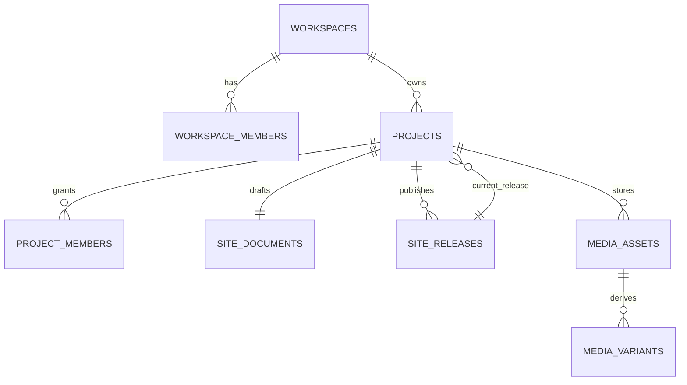

# Local-to-Cloud CMS MVP 계약

현재 실행 모드는 브라우저 `localStorage`와 IndexedDB를 사용하는 `browser-local`이다. 로그인과 권한 UI는 흐름 검증용이며 운영 보안으로 사용하면 안 된다. 다음 구현은 Supabase CLI/Docker의 `local-backend`에서 시작하고, 같은 migration과 타입을 Hosted 환경에 승격한다.

로컬 실행·배포·비용 결정은 [`LOCAL_FIRST_BACKEND.md`](LOCAL_FIRST_BACKEND.md)를 따른다.

## 실행 환경 계약

| 환경 | 역할 | 허용 범위 |
| --- | --- | --- |
| `browser-local` | 현재 UI·미디어 UX 회귀 테스트 | 운영 데이터 금지 |
| `local-backend` | Auth·DB·RLS·Storage·Functions 통합 테스트 | 외부 공개 금지 |
| `hosted-preview` | Supabase Free + Cloudflare 비공개 베타 | 유료 고객·SLA 금지 |
| `production` | Supabase Pro 이상 상용 환경 | 출시 게이트 통과 후 허용 |

## 서버 단계에서 지켜야 하는 요구사항

- 시스템은 Supabase Auth 세션의 `auth.uid()`를 기준으로 워크스페이스와 프로젝트 접근을 판정해야 한다.
- 시스템은 클라이언트가 전달한 역할, 사용자 ID와 프로젝트 ID를 신뢰하지 않아야 한다.
- 시스템은 `workspace_members`, `project_members`와 RLS를 통해 다른 고객의 행과 Storage 객체를 차단해야 한다.
- 역할 이름은 `owner`, `editor`, `reviewer`로 통일해야 한다. 현재 Local `viewer`는 목표 `reviewer`로 매핑한다.
- 편집자는 초안을 저장할 수 있지만 Release를 생성하거나 공개 대상을 변경할 수 없어야 한다.
- 소유자만 공개와 롤백을 수행할 수 있어야 한다.
- 검토자는 초안, 공개 Release, 버전과 미디어를 읽을 수만 있어야 한다.
- 시스템은 초안 저장 시 `draft_revision`을 비교해 오래된 저장이 최신 작업을 덮어쓰지 않도록 해야 한다.
- 시스템은 공개할 때 수정 불가능한 `site_releases` 행을 생성하고 `projects.current_release_id`를 원자적으로 변경해야 한다.
- 시스템은 공개 실패 시 기존 `current_release_id`를 유지해야 한다.
- 시스템은 초안과 공개 Release가 같은 공개 API에서 섞이지 않도록 해야 한다.
- 브라우저에는 Supabase URL과 publishable key만 둘 수 있다. secret key, 기존 `service_role`, R2·결제 비밀키를 Vite 번들에 넣어서는 안 된다.
- 감사 기록은 권한 변경, 초안 저장, 공개, 롤백, 미디어 삭제와 복원을 append-only로 남겨야 한다.

## 목표 데이터 모델



첫 migration에는 최소 다음이 포함되어야 한다.

- `workspaces`, `workspace_members`
- `projects.workspace_id`, `projects.current_release_id`
- `project_members`
- 초안 전용 `site_documents`와 `draft_revision`
- 불변 `site_releases`
- `media_assets`와 원본 상태
- `media_variants` 또는 동일한 파생본 상태 계약
- append-only `audit_logs`
- 테이블, RPC와 `storage.objects` RLS

현재 `supabase/schema.sql`은 위 모델을 모두 구현하지 않은 읽기용 초안이다. 그대로 Hosted DB에 적용하지 않는다.

## 초안·공개 API 계약

구현 방식은 PostgreSQL RPC 또는 서버 API가 될 수 있지만 다음 의미를 유지해야 한다.

### `save_draft(project_id, expected_revision, document)`

- 인증된 `owner` 또는 `editor`만 호출할 수 있어야 한다.
- `expected_revision`이 현재 revision과 다르면 `409 revision_conflict`를 반환해야 한다.
- 콘텐츠 schema 검증에 실패하면 저장하지 않아야 한다.
- 성공하면 증가한 revision과 저장 시각을 반환해야 한다.
- `published` 또는 `current_release_id`를 변경해서는 안 된다.

### `publish_release(project_id, expected_revision)`

- 인증된 `owner`만 호출할 수 있어야 한다.
- 현재 초안과 모든 미디어 참조를 서버에서 다시 검증해야 한다.
- 불변 Release를 생성하고 같은 트랜잭션에서 `current_release_id`를 변경해야 한다.
- 이미 사용한 idempotency key가 들어오면 같은 결과를 반환해야 한다.
- 실패하면 기존 공개 사이트를 유지해야 한다.

### `rollback_release(project_id, release_id)`

- 인증된 `owner`만 호출할 수 있어야 한다.
- 대상 Release가 같은 프로젝트에 속하는지 확인해야 한다.
- 과거 행을 수정하지 않고 `current_release_id`만 원자적으로 변경해야 한다.

## 미디어 저장 계약

저장소 공급자를 코드에 고정하지 않고 `MediaStorageProvider` 경계로 구현한다.

| 단계 | 저장소 | 목적 |
| --- | --- | --- |
| 로컬·Hosted MVP | Supabase Storage | Auth·RLS·DB와 빠른 통합 |
| 사용량 증가 후 | Cloudflare R2 | 원본·파생 이미지 저장·전송 비용 분리 |

논리 객체 키는 공급자와 관계없이 다음 형식을 유지한다.

```text
{projectId}/original/{assetId}/{safeFilename}
{projectId}/derived/{assetId}/{variant}
```

- 원본은 private bucket에 영구 보존해야 한다.
- 공개 랜딩페이지에 필요한 파생본만 public bucket 또는 제한 URL로 제공할 수 있다.
- 업로드 API는 파일당 15MB, 프로젝트당 250MB, 100개 제한을 서버에서 다시 검증해야 한다.
- 허용 포맷과 실제 MIME을 확인하고 확장자만 신뢰하지 않아야 한다.
- HEIC/HEIF 원본은 보존하고 JPEG/WebP 표시본을 별도로 관리해야 한다.
- PC와 모바일 초점 X·Y는 각각 10~90% 범위로 검증해야 한다.
- 캐러셀에서 사용 중인 미디어를 삭제해 최소 3장 규칙을 깨뜨려서는 안 된다.
- 업로드 완료는 실제 객체의 크기와 checksum을 확인한 뒤 `ready`로 전환해야 한다.
- 삭제는 즉시 객체를 제거하지 않고 `deleted_at`을 기록한 뒤 복구 기간 이후 정리해야 한다.
- DB와 객체 저장소가 어긋난 `pending`, `failed`, orphan 객체를 재조정하는 작업이 있어야 한다.
- PostgreSQL 백업이 Storage 객체를 포함한다고 가정해서는 안 된다. DB와 원본·파생 객체를 별도로 백업하고 함께 복원하는 리허설이 있어야 한다.

R2는 다음 백엔드 MVP의 차단 요소가 아니다. Supabase Storage 사용량이나 egress 비용이 임계치에 접근한 뒤 같은 논리 키와 provider 인터페이스로 전환한다.

## 다음 연결 작업

1. 프로젝트 devDependency로 Supabase CLI를 설치하고 `supabase/config.toml`을 생성한다.
2. `supabase/schema.sql` 초안을 `supabase/migrations/`의 첫 migration으로 재설계한다.
3. 두 워크스페이스, 세 역할과 테스트 프로젝트를 `seed.sql`에 구성한다.
4. `db reset`, `db lint`와 교차 프로젝트 RLS 거부 테스트를 통과시킨다.
5. 현재 `auth.js`를 로컬 Supabase Auth 어댑터로 교체한다.
6. 콘텐츠 저장을 `localStorage`에서 revision 기반 `save_draft`로 교체한다.
7. 소유자 전용 `publish_release`와 `rollback_release`를 구현한다.
8. Supabase Storage의 원본·파생 bucket과 객체 RLS를 구현한다.
9. 업로드 티켓과 완료 확인 API에서 프로젝트 용량·개수·checksum을 검증한다.
10. IndexedDB 데이터를 한 번 가져오는 도구를 제공하고 로컬 저장을 읽기 전용 백업으로 남긴다.
11. 모든 로컬 수용 기준을 통과한 뒤에만 Hosted Free Preview를 연결한다.

## 완료 증거

다음 증거 없이 Cloud MVP 완료로 표시하지 않는다.

- migration을 빈 로컬 DB에 적용한 `db reset` 결과
- SQL lint와 생성 TypeScript 타입 결과
- A 워크스페이스가 B 워크스페이스 행·파일을 읽고 쓰지 못하는 자동 테스트
- 편집자의 공개 거부와 소유자의 공개 성공 테스트
- revision 충돌 `409`와 기존 공개본 유지 테스트
- 원본·파생 업로드, 한도 초과 거부와 삭제 복구 테스트
- DB와 Storage 객체의 별도 백업을 같은 프로젝트 상태로 복원한 리허설
- 실제 Hosted Preview에서 Auth·DB·Storage가 연결된 통합 테스트
- `npm run build`와 Cloudflare 멀티페이지 Preview 결과
