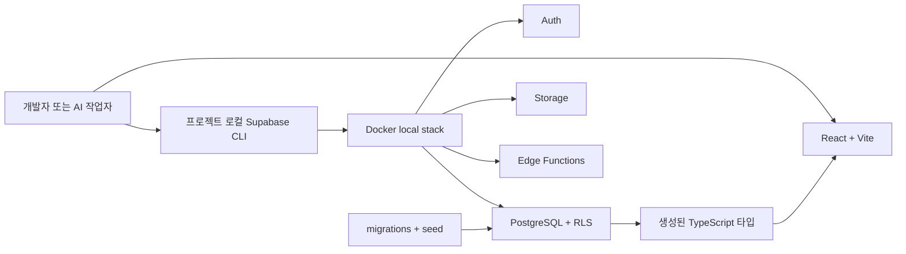
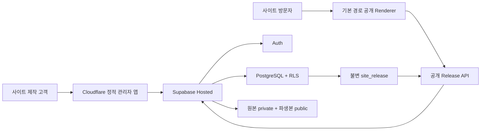

# 비용 우선 Local-first 백엔드와 배포 결정

> 결정일: 2026-08-02
>
> 상태: 채택 — 다음 백엔드 MVP의 기준선
>
> 범위: 로컬 개발, 비공개 베타, 첫 유료 고객 전환까지

## 1. 결론

현재 프로젝트는 다음 단계형 아키텍처를 사용한다.

1. **로컬 개발**: React/Vite + Supabase CLI/Docker로 Auth, PostgreSQL/RLS, Storage, Edge Functions를 실행한다.
2. **비공개 베타**: Supabase Free + Cloudflare Workers Static Assets를 한도 안에서 사용한다.
3. **첫 유료 고객**: 공개 전에 Supabase Pro로 전환하고, 동적 라우팅이 필요할 때만 Workers Paid를 추가한다.
4. **성장 단계**: 미디어 사용량이 임계치를 넘으면 `MediaStorageProvider`를 통해 Cloudflare R2로 분리한다.

Vercel은 폐기하지 않는다. SEO 중심의 Next.js 공개 Renderer나 Vercel의 Preview·Domain 자동화가 비용보다 중요해질 때 **Vercel Pro 유료 대안**으로 선택한다. Vercel Hobby는 개인·비상업용이므로 상용 SaaS의 무료 운영안으로 계산하지 않는다.

여기서 Local-first는 오프라인 동기화 제품이라는 뜻이 아니다. **클라우드 계정 없이 동일한 Auth·DB·RLS·Storage 계약을 먼저 검증하고, 검증된 migration과 빌드 산출물을 원격에 승격하는 개발 방식**을 뜻한다.

개인 PC의 로컬 Supabase를 인터넷이나 터널로 공개해 운영 서버처럼 사용하지 않는다. 로컬 스택은 TLS, 운영용 rate limit, 안전한 기본 자격 증명과 가용성 보장이 없는 개발 환경이다.

## 2. 선택 이유

- 현재 `supabase/schema.sql`은 PostgreSQL, `auth.users`, RLS를 전제로 하므로 재작성 비용이 가장 낮다.
- Supabase CLI는 로컬에서 Auth, PostgreSQL, Storage, Studio, Mailpit과 Edge Functions를 함께 재현한다.
- migration, seed, 생성된 TypeScript 타입을 Git으로 관리하면 사람이든 AI든 동일한 데이터 계약에서 작업할 수 있다.
- React/Vite 빌드 결과인 `dist`를 로컬에서 만든 뒤 Cloudflare CLI로 배포할 수 있다.
- 무료 한도는 검증 비용을 낮추고, 실제 매출이 생길 때 관리형 백업과 가용성에 비용을 지불할 수 있다.
- PocketBase, Appwrite, D1 또는 자체 PostgreSQL API로 바꾸면 현재 RLS·Auth·Storage 계약을 상당 부분 다시 구현해야 한다.

## 3. 실행 프로필

| 프로필 | 목적 | 데이터 위치 | 외부 비용 | 운영 사용 |
| --- | --- | --- | ---: | --- |
| `browser-local` | 현재 UI·02B 회귀 검증 | `localStorage` + IndexedDB | $0 | 금지 |
| `local-backend` | 실제 Auth·RLS·Storage 통합 개발 | Docker의 로컬 Supabase | $0 | 금지 |
| `hosted-preview` | 내부 사용자·비공개 베타 | Supabase Free + Cloudflare | $0 가능 | 유료 고객 금지 |
| `production` | 첫 유료 고객과 상용 운영 | Supabase Pro + Cloudflare | 약 $25~30부터 | 출시 게이트 통과 후 허용 |

현재 `VITE_STORAGE_MODE=local`은 `browser-local`을 뜻한다. 다음 구현에서는 의미가 섞이지 않도록 `browser-local`, `supabase-local`, `supabase-hosted`를 명시적으로 구분하는 설정으로 전환한다.

## 4. 아키텍처

### 로컬 개발



### 비공개 베타와 상용 승격



비공개 베타는 `workers.dev` 기본 주소와 경로 기반 사이트 URL부터 시작한다. 고객 도메인, hostname 라우팅, DNS·SSL 자동화는 도메인 MVP에서 별도로 추가한다. 공개 API는 현재 초안이 아니라 `current_release_id`가 가리키는 불변 Release만 반환해야 한다.

## 5. 기술 스택

| 영역 | 채택 기술 | 이유 |
| --- | --- | --- |
| 관리자·공개 UI | 기존 React + Vite + TypeScript 전환 | 현재 구현과 회귀 기준을 유지하고 정적 배포가 단순함 |
| 입력 계약 | Zod | 런타임 데이터와 CMS schema 검증을 코드 가까이 유지 |
| 인증 | Supabase Auth | 로컬과 Hosted에서 동일한 세션 계약 사용 |
| 데이터베이스 | PostgreSQL + RLS | 멀티테넌트 행 격리를 DB에서 재검증 |
| DB 변경 | Supabase SQL migrations | 재현·리뷰·롤백 판단이 가능한 Git 기반 변경 기록 |
| 파일 | Supabase Storage 우선 | Auth·RLS와 빠르게 통합, R2는 사용량 이후 분리 |
| 서버 작업 | Supabase Edge Functions | 업로드 티켓, 사용량 검사, 공개 RPC 보조 같은 짧은 작업 |
| 정적 배포 | Cloudflare Workers Static Assets | 로컬 `dist` 직접 배포, 정적 요청 비용 최소화 |
| 동적 Edge | Cloudflare Worker 선택 | hostname 라우팅이나 가벼운 공개 API가 필요할 때만 사용 |
| 결제 | PortOne V2 + TossPayments 어댑터 | 국내 구독 결제와 entitlement를 분리해 구현 |

Edge Functions에서 HEIC 변환이나 무거운 이미지 리사이즈를 수행하지 않는다. MVP에서는 브라우저가 표시용 JPEG/WebP를 생성하고 원본과 파생본을 함께 업로드한다. 서버는 크기, MIME, checksum, 프로젝트 소유권과 한도를 검증한다.

## 6. 비용 단계

> 아래 금액은 2026-08-02 공식 가격 기준 계획값이다. 부가세, 환율, 도메인 구입·갱신, SMTP·SMS, PG 수수료와 유료 모니터링은 제외한다.

| 단계 | 월 인프라 계획값 | 포함 | 허용 범위 |
| --- | ---: | --- | --- |
| 로컬 개발 | $0 | 개발자 PC의 Docker·Vite | 기능 개발과 자동 테스트 |
| 비공개 베타 | $0 가능 | Supabase Free + Cloudflare 무료 한도 | 내부 검증·소수 초대 사용자 |
| 첫 유료 고객 | 약 $25~30부터 | Supabase Pro $25 + 필요 시 Workers Paid $5 | 출시 게이트 통과 후 상용 운영 |
| Vercel 선택 | 위 비용에 $20부터 추가 | Vercel Pro 1명 기준 | Next.js·Preview·도메인 자동화가 필요할 때 |

Supabase Free는 활성 프로젝트 2개, 프로젝트당 DB 500MB, Storage 1GB, egress 5GB, Auth 50,000 MAU, Edge Functions 월 500,000회 범위다. 저활동 프로젝트는 약 1주 후 중지될 수 있고 자동 백업이 없으므로, 무료 베타를 안정적인 운영 환경으로 표현하면 안 된다.

Cloudflare 정적 자산 요청은 무료이며 동적 Worker 코드가 실행될 때 Free 한도인 일 100,000요청과 요청당 10ms CPU가 적용된다. 따라서 MVP 공개 화면은 무거운 SSR보다 정적 Renderer와 짧은 Release 조회를 우선한다.

## 7. 대안 검토 결과

| 후보 | 장점 | 현재 프로젝트의 비용 | 결론 |
| --- | --- | --- | --- |
| Supabase Local → Hosted | 현재 PostgreSQL/RLS 재사용, 로컬·원격 계약 동일 | 가장 낮음 | **채택** |
| PocketBase | 단일 실행 파일, 빠른 내부 프로토타입 | SQL/RLS 전면 재작성, 공식 문서상 production-critical 비권장 | 단일 사이트 데모만 |
| Appwrite Cloud/Self-host | Auth·DB·Storage 통합 | 별도 권한 모델로 재작성, 자체 운영 컨테이너 부담 | 현재는 보류 |
| PostgreSQL + 자체 API | 통제권과 RLS 유지 | Auth·Storage·세션·API·백업 직접 구현 | 전담 백엔드 인력 확보 후 |
| Supabase 자체 호스팅 | 공급자 청구액 절감 가능 | TLS·SMTP·백업·패치·모니터링·복구 직접 운영 | 사용자와 SRE 확보 후 |
| Cloudflare D1 Native | Edge 비용이 낮음 | SQLite이며 PostgreSQL RLS 없음 | 현재 계약과 부적합 |
| OCI Always Free | 한도 안에서 $0 가능 | 회수·가용성·백업·보안 운영 위험 | 데모·비공개 실험만 |

자체 호스팅은 청구서를 줄일 수 있지만 총비용을 줄인다고 단정할 수 없다. 장애 대응, 백업 복원, 보안 패치와 운영 시간을 비용에 포함하면 현재 1인 개발 단계에서는 관리형 서비스가 더 합리적이다.

## 8. 저장소 목표 구조

다음 구조는 **다음 MVP에서 생성할 목표**이며 현재 모두 구현되어 있지는 않다.

```text
supabase/
  config.toml
  migrations/
    <timestamp>_initial_platform_schema.sql
  seed.sql
  functions/
    media-upload-ticket/
    media-upload-finalize/
src/
  lib/
    supabase-client.ts
    database.types.ts
wrangler.jsonc
```

- `supabase/migrations/`가 DB 변경의 단일 진실 공급원이다.
- `supabase/schema.sql`은 유지한다면 읽기용 최신 스냅샷으로만 사용한다.
- Dashboard에서만 스키마나 정책을 수정하지 않는다. 모든 변경은 migration으로 다시 기록한다.
- `database.types.ts`는 생성 파일이며 수동으로 편집하지 않는다.
- seed에는 실제 고객 개인정보나 운영 비밀값을 넣지 않는다.

## 9. 로컬 개발 절차

아래 명령은 목표 절차다. 아직 이 저장소에서 실행·검증된 상태가 아니다.

### 최초 구성

```powershell
npm install @supabase/supabase-js
npm install --save-dev supabase wrangler
npx supabase init
npx supabase migration new initial_platform_schema
```

기존 `supabase/schema.sql`을 그대로 배포하지 않는다. 워크스페이스, 불변 Release, 역할, Storage 정책과 안전한 RPC를 보완한 첫 migration으로 옮긴다.

### 일상 개발

초기화와 타입 생성은 먼저 실행한다.

```powershell
npx supabase start
npx supabase db reset
npx supabase db lint
npx supabase gen types typescript --local > src/lib/database.types.ts
```

그다음 장기 실행 프로세스는 서로 다른 터미널에서 실행한다.

```powershell
# 터미널 1
npx supabase functions serve

# 터미널 2
npm run dev
```

협업자가 `db reset` 한 번으로 같은 스키마와 테스트 seed를 재현해야 한다. 생성된 테스트 사용자는 최소 두 워크스페이스에 나눠 교차 프로젝트 접근 거부를 검증한다.

### Hosted Supabase 승격

원격 계정이 준비된 이후에만 실행한다.

```powershell
npx supabase login
npx supabase link --project-ref <PROJECT_REF>
npx supabase db push --dry-run
npx supabase db push
npx supabase functions deploy
npx supabase migration list
```

- `db push --dry-run` 결과를 리뷰한 뒤 적용한다.
- 운영 DB에 `db reset --linked`를 실행하지 않는다.
- 운영 프로젝트에는 개발 seed를 넣지 않는다.
- 브라우저에는 Supabase URL과 publishable key만 둔다.
- secret key, 기존 `service_role` 키와 결제·R2 비밀키는 Vite 변수로 만들지 않는다.

## 10. 로컬 빌드 후 Cloudflare 배포

현재 앱은 `index.html`, `admin.html`, `preview.html`을 가진 멀티페이지 앱이다. 모든 404를 `index.html`로 보내는 SPA fallback을 적용하면 안 된다.

목표 `wrangler.jsonc`의 핵심은 다음과 같다.

```jsonc
{
  "$schema": "./node_modules/wrangler/config-schema.json",
  "name": "cello-site-builder",
  "compatibility_date": "2026-08-02",
  "assets": {
    "directory": "./dist",
    "not_found_handling": "404-page"
  }
}
```

계정 없이 로컬 산출물과 Cloudflare 런타임 호환성을 확인한다.

```powershell
npm run build
npx wrangler dev
```

Cloudflare 계정과 프로젝트가 준비되면 로컬에서 만든 동일한 산출물을 배포한다.

```powershell
npx wrangler login
npm run build
npx wrangler deploy
```

Pages Direct Upload도 가능하지만 같은 프로젝트를 나중에 Git Integration으로 전환할 수 없다. 반복 배포와 협업을 고려해 기본안은 Workers Static Assets로 두고, Pages를 선택한다면 처음부터 Git Integration 프로젝트를 만든다.

## 11. Vibe coding 안전장치

AI와 협업자가 빠르게 구현하더라도 다음 계약은 생략하지 않는다.

1. 시스템은 SQL migration, Zod schema와 생성 DB 타입을 같은 변경에서 동기화해야 한다.
2. 시스템은 `owner`, `editor`, `reviewer` 역할을 DB에서 다시 판정해야 한다. 현재 Local `viewer`는 목표 `reviewer`로 매핑한다.
3. 시스템은 `save_draft(project_id, expected_revision, document)`와 소유자 전용 `publish_release(...)`를 분리해야 한다.
4. 시스템은 `site_releases`를 불변으로 저장하고 `projects.current_release_id`만 원자적으로 바꿔야 한다.
5. 시스템은 다른 워크스페이스의 행과 Storage 객체에 대한 읽기·쓰기 거부 테스트를 포함해야 한다.
6. 시스템은 원본을 private bucket에 보존하고 공개 파생본만 public bucket에 둘 수 있다.
7. 시스템은 파일당 15MB, 프로젝트당 250MB·100개와 초점 10~90% 제한을 서버에서 다시 검증해야 한다.
8. AI가 만든 migration은 diff와 dry-run을 먼저 보여주고, 명시적 적용 전 원격 DB를 변경하지 않아야 한다.
9. 로컬 Supabase 포트와 Studio를 인터넷 또는 터널에 공개하지 않아야 한다.

## 12. 비용 전환 조건

| 조건 | 조치 |
| --- | --- |
| 첫 유료 고객을 받기 전 | Supabase Pro, DB 백업과 별도 Storage 객체 백업, 두 복원 리허설, 비용 알림 활성화 |
| 동적 Worker가 무료 CPU·요청 한도에 접근 | Workers Paid 전환 또는 캐시·정적화 개선 |
| Supabase Storage·egress 비용 변동성이 커짐 | `MediaStorageProvider`를 구현해 R2로 원본·파생본 분리 |
| SEO, 서버 렌더링, Preview 자동화 가치가 월 $20 이상 | Vercel Pro 기반 별도 Public Renderer 비교 |
| 계약형 SLA·전용망·물리 격리 요구 발생 | OCI/AWS 또는 자체 운영을 SRE 인력과 함께 재검토 |

서비스 사용자가 없다는 이유만으로 유료 인프라를 먼저 만들지 않는다. 반대로 첫 유료 고객을 무료 플랜의 중지 가능성과 무백업 상태에 올려놓지도 않는다.

## 13. 현재 저장소와 PC 확인 결과

- React/Vite 멀티페이지 프로덕션 빌드는 이미 구성되어 있다.
- 실제 데이터는 아직 `localStorage`와 IndexedDB에 저장된다.
- `@supabase/supabase-js`, 프로젝트 로컬 Supabase CLI, Wrangler 설정과 migration 구조는 아직 없다.
- Docker CLI는 설치되어 있으나 Docker Engine은 현재 실행 중이지 않다.
- PC 메모리는 약 16GB이므로 로컬 Supabase를 시도할 수 있지만 Docker 메모리 할당과 실제 실행 검증이 필요하다.
- 현재 `supabase/schema.sql`은 워크스페이스, 불변 Release, 안전한 공개 RPC, Storage 정책과 총용량 제한이 빠진 초안이다.

따라서 이 문서 반영은 아키텍처 결정 완료를 뜻하며, 로컬 백엔드가 실행됐거나 클라우드 배포가 완료됐다는 뜻은 아니다.

## 14. 다음 백엔드 MVP 완료 기준

- [ ] Supabase CLI를 프로젝트 devDependency로 설치하고 `config.toml`을 생성한다.
- [ ] `schema.sql` 초안을 첫 migration으로 재설계한다.
- [ ] 워크스페이스, 프로젝트, 멤버십, 불변 Release와 안전한 RPC를 구현한다.
- [ ] 원본 private·파생본 public Storage bucket과 객체 RLS를 구현한다.
- [ ] seed 사용자 두 그룹으로 교차 프로젝트 읽기·쓰기 차단 테스트를 통과한다.
- [ ] Supabase Auth 로그인과 CMS 세션을 연결한다.
- [ ] 초안 저장, 공개, 롤백을 PostgreSQL에서 검증한다.
- [ ] 원본·파생본 업로드와 프로젝트 용량 제한을 서버에서 검증한다.
- [ ] `npm run build`와 `npx wrangler dev`로 멀티페이지 동작을 확인한다.
- [ ] DB와 Storage 객체의 별도 백업·복원 절차를 검증한다.
- [ ] 내부 수용 기준을 통과한 뒤에만 Hosted Free Preview를 만든다.

## 15. 공식 참고 자료

- [Supabase Local Development](https://supabase.com/docs/guides/local-development/cli-workflows)
- [Supabase TypeScript Type Generation](https://supabase.com/docs/guides/api/rest/generating-types)
- [Supabase Pricing](https://supabase.com/pricing)
- [Supabase Free Project Pausing](https://supabase.com/docs/guides/platform/free-project-pausing)
- [Supabase Edge Functions Limits](https://supabase.com/docs/guides/functions/limits)
- [Supabase API Key Security](https://supabase.com/docs/guides/getting-started/api-keys)
- [Cloudflare Workers Static Assets](https://developers.cloudflare.com/workers/static-assets/)
- [Cloudflare Static Assets Billing and Limits](https://developers.cloudflare.com/workers/static-assets/billing-and-limitations/)
- [Cloudflare Workers Pricing](https://developers.cloudflare.com/workers/platform/pricing/)
- [Cloudflare Pages Direct Upload](https://developers.cloudflare.com/pages/get-started/direct-upload/)
- [Cloudflare R2 Pricing](https://developers.cloudflare.com/r2/pricing/)
- [Vercel Pricing](https://vercel.com/pricing)
- [PocketBase Documentation](https://pocketbase.io/docs/)
- [Appwrite Self-hosting](https://appwrite.io/docs/advanced/self-hosting)
- [OCI Always Free Resources](https://docs.oracle.com/en-us/iaas/Content/FreeTier/freetier_topic-Always_Free_Resources.htm)
