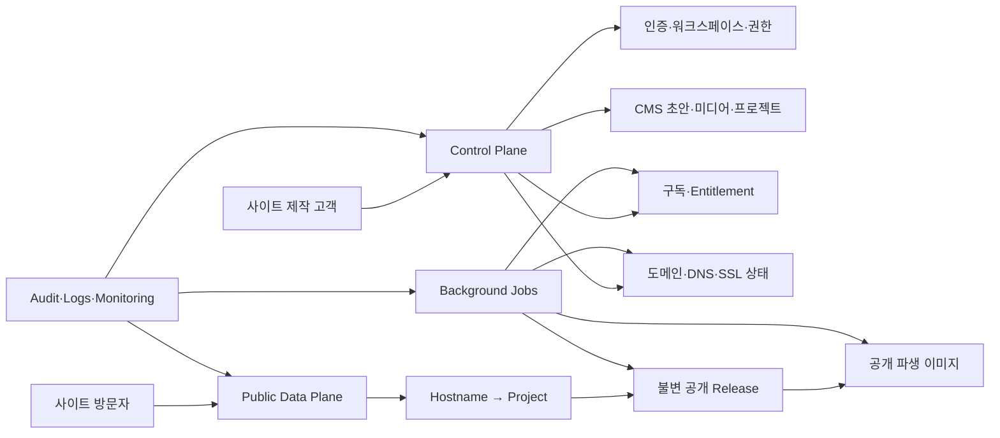
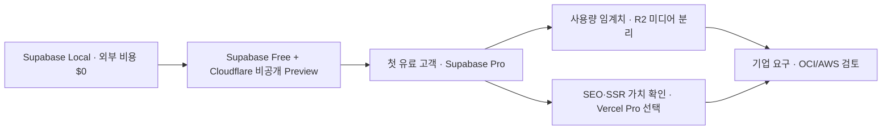

# 웹사이트 빌더 SaaS 대안 아키텍처와 비용 계획

> 기준일: 2026-08-02
>
> 대상: 레슨·회사·레스토랑·웨딩 사이트를 제작·운영하는 멀티테넌트 CMS 플랫폼
>
> 상태: 의사결정 문서 — 실제 공급자 계정과 운영 트래픽이 생기면 공식 계산기로 다시 산정

## 1. 문서 목적

이 프로젝트는 단일 랜딩페이지가 아니라 다음 기능을 제공하는 웹사이트 제작 SaaS를 목표로 한다.

- 고객 회원가입과 로그인
- 워크스페이스·프로젝트·구성원 관리
- 업종별 CMS 편집과 미디어 업로드
- 초안·미리보기·공개 버전·롤백
- 기본 서브도메인과 고객 보유 도메인 연결
- 플랫폼 구독 결제와 요금제별 사용 권한
- 감사 로그, 오류 추적, 사용량 감시, 백업과 복구

Supabase, OCI, AWS 또는 Cloudflare 하나가 모든 기능을 자동으로 완성하지 않는다. 시스템은 인증·데이터·미디어·공개·도메인·결제·운영의 역할을 분리하고 공급자별 어댑터를 통해 조합해야 한다.

## 2. 공통 논리 구조



### 공개 방식

고객이 `공개`를 누를 때마다 고객별 애플리케이션을 새로 빌드하지 않는다.

1. 초안과 미디어 참조를 검증한다.
2. 수정 불가능한 `site_release`를 생성한다.
3. 프로젝트의 `current_release_id`를 원자적으로 교체한다.
4. hostname과 release ID 기준 캐시를 무효화한다.
5. 실패하면 기존 공개 버전을 그대로 유지한다.

플랫폼 코드 롤백과 고객 콘텐츠 롤백은 서로 분리해야 한다.

## 3. 비용 비교 전제

아래 비용은 USD/월 기준 계획값이다. 부가세, 환율, 도메인 구입·갱신, SMTP·SMS, PG 가입비와 결제수수료, 유료 모니터링은 제외한다.

| 기준 | 상용 베타 | 성장 단계 |
| --- | ---: | ---: |
| 고객 사이트 | 50개 | 500개 |
| 편집 사용자 | 10명 | 1,000명 |
| 원본과 파생 이미지 | 25GB | 250GB |
| 월 페이지뷰 | 50만 | 500만 |
| 월 이미지 전송 | 100GB | 1TB |
| 배포 권한 개발자 | 1명 | 3명 |

공개 방문자는 보통 로그인하지 않으므로 CMS 사용자 MAU보다 미디어 저장·전송량이 먼저 비용 병목이 될 가능성이 높다.

## 4. 대안 한눈에 보기

로컬 개발 프로필은 운영 공급자의 대안이 아니다. 아래 H안은 로컬에서 동일한 Supabase 계약을 검증한 뒤 Free Preview와 유료 운영으로 단계적으로 승격하는 **개발·운영 결합 경로**다. 개인 PC의 Docker 스택을 공개 서버로 사용한다는 뜻이 아니다.

| 대안 | 상용 베타 예상 | 성장 단계 예상 | 구현 난이도 | 운영 부담 | 적합한 시점 |
| --- | ---: | ---: | --- | --- | --- |
| H. Local-first Supabase + Cloudflare | $0 비공개 / $25~30 유료 | $30~200 | 낮음~중간 | 낮음 | **현재 채택** |
| A. Supabase + Vercel | $45~70 | $90~250 | 낮음 | 낮음 | 가장 빠른 상용 MVP |
| B. Supabase + Vercel + R2 | $45~65 | $95~220 | 중간 | 중간 | 이미지 트래픽 증가 |
| C. Neon + Vercel + R2 | $35~65 | $100~400 | 중간 | 중간 | Supabase 대체 필요 |
| D. Cloudflare Native | $5~40 + Auth | $30~200 + Auth | 높음 | 중간 | 비용 최우선, RLS 요구 변경 가능 |
| E. OCI 관리형 | $150~300 | $300~700 이상 | 높음 | 높음 | Oracle·기업 보안 요구 |
| F. OCI Always Free 자체운영 | $0~50 | 유료 운영 비권장 | 매우 높음 | 매우 높음 | 개발·데모·비공개 파일럿 |
| G. AWS Serverless | $30~150 | $150~800 이상 | 높음 | 높음 | AWS 조직·기업 통제 요구 |

비용 범위는 공식 단가에 위 가정을 적용한 계획 추정이며 견적이 아니다. 공급자 선택 전에 서울 리전, 캐시 적중률, 이미지 변환 수, 백업 보존 기간을 공식 계산기에 다시 입력해야 한다.

## 5. A안 — Supabase + Vercel

### 구성

- Vercel Next.js: 관리자·공개 렌더러, Preview, CDN, SSL, hostname 라우팅
- Supabase Auth: 이메일·소셜 로그인과 세션
- Supabase PostgreSQL + RLS: 워크스페이스·프로젝트·CMS·버전·결제 상태
- Supabase Storage: 원본과 표시용 미디어
- PortOne/TossPayments: 플랫폼 구독 결제
- Sentry와 자체 `audit_logs`: 오류와 업무 감사 기록

### 비용 기준

- Supabase Pro: $25/월부터
- Vercel Pro: 배포 개발자 1명 기준 $20/월부터
- 상용 최소선: 약 $45/월
- 별도 Supabase staging Micro: 약 $10/월 추가
- Vercel 배포 개발자 추가: 1명당 $20/월

### 장점

- Auth JWT와 PostgreSQL RLS를 가장 빠르게 연결할 수 있다.
- 현재 `supabase/schema.sql`과 데이터 구조를 재사용할 수 있다.
- 공급자와 비밀키 수가 가장 적다.
- 공개 URL, Preview, SSL과 커스텀 도메인 자동화가 빠르다.

### 단점과 주의점

- 이미지 원본을 Vercel 이미지 변환으로 다시 프록시하면 Supabase와 Vercel 양쪽 전송·변환 비용을 확인해야 한다.
- 데이터베이스 백업과 Storage 객체 백업은 별도로 설계해야 한다.
- 이미지 파생 생성은 별도 Worker가 더 적합하다.
- 고객마다 Supabase 프로젝트를 만들면 컴퓨팅 비용이 고객 수에 비례해 증가한다.

### 개발 리소스 계획

- 12~18 엔지니어 주
- 숙련 풀스택 1명과 파트타임 QA·보안 검토 또는 프론트·백엔드 각 1명
- 출시 후 정기 운영 약 월 2~4시간

## 6. B안 — Supabase + Vercel + Cloudflare R2

### 구성

- 인증·DB·RLS는 Supabase 유지
- 관리자와 공개 렌더러는 Vercel 유지
- 원본과 파생 이미지 저장·전송만 R2로 분리
- 이미지 변환은 Queue와 idempotent Worker로 처리

### 비용 기준

R2 Standard는 10GB 저장, Class A 100만 건, Class B 1천만 건이 월 무료다. 초과 저장은 $0.015/GB-month이며 인터넷 egress는 무료다.

| R2 저장량 | 저장 비용 예시 |
| ---: | ---: |
| 10GB | $0 |
| 100GB | 약 $1.35 |
| 250GB | 약 $3.60 |
| 1TB | 약 $14.85 |

### 장점

- 공개 이미지 전송량이 증가해도 egress 비용이 낮다.
- 원본, desktop, mobile, thumbnail 객체를 명시적으로 보존할 수 있다.
- DB 공급자를 나중에 이전하더라도 미디어를 동시에 옮길 필요가 없다.
- 현재 `docs/CLOUD_MVP.md`의 원본·파생 객체 키 계약을 활용할 수 있다.

### 단점과 추가 구현

- DB 행과 R2 객체는 단일 트랜잭션이 아니므로 `pending → processing → ready/failed` 상태가 필요하다.
- signed upload, CORS, MIME·크기·checksum 검증을 구현해야 한다.
- DB와 객체 저장소의 누락·고아 파일을 재조정하는 작업이 필요하다.
- 공급자별 장애와 비용 알림이 분산된다.

### 개발 리소스 계획

- 15~22 엔지니어 주
- 출시 후 정기 운영 약 월 4~8시간

총 공개 이미지 전송이 월 200~250GB에 접근하거나 이미지 비용 변동성이 커질 때 A안에서 B안으로 전환한다.

## 7. C안 — Neon + Vercel + R2

### 구성

- Neon PostgreSQL·Auth·RLS
- Vercel Next.js·Preview·멀티테넌트 도메인
- R2 미디어와 이미지 Worker

### 장점

- PostgreSQL과 RLS를 유지하면서 Supabase 의존성을 줄일 수 있다.
- 개발·Preview 환경별 DB 브랜치를 만들기 쉽다.
- 유휴 DB scale-to-zero와 사용량 기반 과금이 가능하다.

### 단점

- Storage, 이미지 변환과 통합 운영 화면을 별도로 구성해야 한다.
- scale-to-zero 이후 첫 요청 지연을 고려해야 한다.
- Vercel, Neon, R2의 비밀키·로그·비용을 함께 관리해야 한다.

### 개발 리소스 계획

- 16~24 엔지니어 주
- 출시 후 정기 운영 약 월 4~8시간

Supabase를 사용하지 않으면서 PostgreSQL/RLS와 빠른 출시를 유지하려는 경우 우선 검토한다.

## 8. D안 — Cloudflare Native

### 구성

- Workers/Pages: 관리자, 공개 렌더러, API
- D1: 프로젝트·콘텐츠·버전
- R2: 원본·파생 미디어
- Images: 이미지 변환
- Queues/Workflows: 공개·변환·재시도
- Cloudflare for SaaS: 고객 도메인, SSL과 edge routing
- 별도 Auth 또는 자체 인증 서버

### 장점

- Workers Paid는 $5/월부터 시작하고 R2 egress가 무료라 인프라 비용이 낮다.
- 정적 파일, CDN, DNS, SSL과 WAF를 한 플랫폼에서 운영할 수 있다.
- Cloudflare for SaaS는 100개 custom hostname을 포함하고 이후 hostname당 $0.10 단가를 제공한다.

### 단점

- D1은 SQLite이며 PostgreSQL RLS가 없다.
- 현재 요구사항의 서버 RLS를 유지하려면 Neon 또는 외부 PostgreSQL을 조합해야 한다.
- 순수 D1 구성에서는 모든 API가 `project_id`와 역할을 빠짐없이 검사해야 한다.
- 인증, 초대, 비밀번호 재설정과 세션 폐기를 별도 구축해야 한다.

### 개발 리소스 계획

- 18~28 엔지니어 주
- 출시 후 정기 운영 약 월 6~12시간

인프라 비용이 최우선이고 PostgreSQL/RLS 요구 변경을 수용할 수 있을 때 선택한다.

## 9. E안 — OCI 관리형

### 구성

- OCI IAM External User
- API Gateway + Functions 또는 Container API
- OCI Database with PostgreSQL
- Object Storage
- Events·Queue·이미지 Worker
- Vault, Logging, Monitoring, APM
- VCN, private subnet, Service Gateway와 Terraform

### 비용 기준

공식 단가를 최소 단일 노드에 적용하면 OCI 관리형 PostgreSQL은 약 $117/월부터이며 스토리지·백업·API·애플리케이션 컴퓨팅이 추가된다. 2노드 HA는 노드 비용 약 $234 이상부터 시작한다. 운영 계획값은 단일 노드 $150~300, HA $300~700 이상으로 잡고 서울 리전 계산기로 다시 산정한다.

### 장점

- PostgreSQL 스키마와 RLS를 유지할 수 있다.
- VCN, Vault, IAM, 감사, HA와 기업 보안 통제가 강하다.
- 외부 데이터 전송 무료 구간이 크다.
- Oracle 계약이나 전담 인력이 있는 조직에 적합하다.

### 단점

- Auth, API, Storage 권한, Realtime과 업로드 파이프라인을 직접 조립해야 한다.
- Supabase Pro보다 데이터베이스 비용 하한이 높다.
- 네트워크와 IAM 구성이 복잡하며 DevOps/SRE 역량이 필요하다.

### 개발 리소스 계획

- 22~34 엔지니어 주
- 프론트·백엔드와 0.5명 이상의 DevOps/SRE
- 출시 후 정기 운영 약 월 8~16시간

Oracle 계약, 데이터 격리, 전용 네트워크 또는 기업 SLA 요구가 확정된 뒤 선택한다.

## 10. F안 — OCI Always Free 자체운영

### 구성

- A1 VM에 Node.js API, PostgreSQL, 이미지 Worker 직접 운영
- Object Storage 직접 업로드
- 무료 Load Balancer 또는 Network Load Balancer
- 자체 백업, WAL, 모니터링과 장애 대응

### 장점

- 무료 한도 안에서 현금 인프라 비용을 $0까지 낮출 수 있다.
- PostgreSQL과 애플리케이션을 직접 통제할 수 있다.

### 단점

- Always Free에는 유료 운영 수준의 SLA와 기술지원이 없다.
- 단일 VM은 API·DB·이미지 처리의 단일 장애점이다.
- OS·Docker·PostgreSQL 보안 패치와 복구를 직접 담당해야 한다.
- 무료 자원의 회수, 용량 부족과 서비스 한도 변경 가능성이 있다.

### 개발 리소스 계획

- 25~40 엔지니어 주
- 출시 후 정기 운영 약 월 12~30시간과 장애 대응 담당자

개발, 데모와 비공개 파일럿에만 사용하고 유료 고객 사이트의 유일한 운영 환경으로 사용하지 않는다.

## 11. G안 — AWS Serverless

### 구성

- CloudFront·S3
- Cognito
- API Gateway·Lambda
- Aurora PostgreSQL Serverless v2
- SQS·Lambda 이미지 Worker
- CloudWatch·CloudTrail·AWS Backup·Secrets Manager·KMS

### 장점

- IAM, KMS, 감사, 백업, 리전과 보안 통제가 강하다.
- Aurora PostgreSQL을 사용하면 RLS를 유지할 수 있다.
- 서비스별로 독립 확장하고 기업 요구에 대응하기 쉽다.

### 단점

- IAM, 네트워크와 비용 항목이 많다.
- Lambda와 PostgreSQL 연결 풀, cold start와 재시도를 설계해야 한다.
- 고객 도메인이 많아지면 CloudFront multi-tenant distribution과 과금 모델을 따로 검토해야 한다.

### 개발 리소스 계획

- 24~36 엔지니어 주
- 프론트·백엔드와 0.5명 이상의 DevOps/SRE
- 출시 후 정기 운영 약 월 8~20시간

AWS 전문 인력 또는 기업 고객의 AWS 기반 보안·감사 요건이 있을 때 선택한다.

## 12. 현재 프로젝트 권장 결정

### 채택안 — H. Local-first Supabase + Cloudflare

1. 현재 React/Vite CMS·Renderer를 유지한다.
2. Supabase CLI/Docker에서 Auth, PostgreSQL/RLS, Storage와 Edge Functions를 먼저 구현한다.
3. SQL migration, seed, 생성된 TypeScript 타입과 교차 프로젝트 RLS 테스트를 Git 기준선으로 만든다.
4. 로컬 수용 기준을 통과하면 Supabase Free와 Cloudflare Workers Static Assets에 비공개 Preview를 배포한다.
5. 첫 유료 고객을 받기 전에 Supabase Pro, 백업·복원 훈련과 비용 알림을 출시 게이트로 적용한다.
6. 초기 미디어는 Supabase Storage로 구현하고 `MediaStorageProvider`를 통해 R2 이전 경계를 확보한다.
7. 공개 화면은 무거운 SSR보다 정적 Renderer와 불변 Release 조회를 우선한다.
8. 구독은 PortOne V2 + TossPayments 어댑터로 구현하고 공급자 로그와 별도의 append-only 감사 기록을 남긴다.

Cloudflare 배포는 로컬 `dist`를 동일하게 올리는 Workers Static Assets를 기본으로 한다. 현재 앱은 멀티페이지이므로 SPA fallback을 사용하지 않는다. Supabase Free의 중지 가능성과 무백업 상태 때문에 무료 Preview는 유료 고객 운영이나 SLA 제공에 사용하지 않는다.

Vercel은 폐기하지 않는다. 별도 Next.js Public Renderer, SEO, Preview 자동화 또는 Domain API의 가치가 월 비용보다 커질 때 A안으로 전환한다. Vercel Hobby는 개인·비상업용이므로 상용 무료 대안으로 계산하지 않는다.

구체적인 저장소 구조, 로컬·원격 명령과 보안 게이트는 [`LOCAL_FIRST_BACKEND.md`](LOCAL_FIRST_BACKEND.md)를 따른다.

### 확장 순서



공급자 전환은 사용자 수 자체가 아니라 다음 조건으로 결정한다.

- 첫 유료 고객 또는 Free 프로젝트 중지 위험을 허용할 수 없는 시점
- 이미지 저장·전송 비용 변동성이 목표를 지속적으로 초과하는 경우
- SEO, SSR, Preview 또는 고객 도메인 자동화가 Vercel Pro 비용보다 큰 가치를 만드는 경우
- 계약형 SLA 또는 전용 네트워크 요구
- 고객별 물리 격리나 데이터 지역 요구
- 현재 공급자 한도 때문에 기능 제공이 불가능한 경우
- 월 비용과 매출의 비율이 목표를 지속적으로 초과하는 경우
- 전담 플랫폼·SRE 인력이 확보된 경우

## 13. 공통 구현 백로그

### P0 — 보안과 데이터 격리

- `workspaces`, `workspace_members`, `projects`, `project_members` 구현
- `owner`, `editor`, `reviewer` 역할의 서버 권한 적용
- 다른 워크스페이스의 행과 파일 접근을 차단하는 자동 테스트
- 서버 비밀키와 브라우저 공개 키 분리
- HTML 정제와 임의 JavaScript·iframe 삽입 금지

### P0 — CMS와 공개

- revision 기반 초안 저장과 충돌 응답
- 불변 `site_releases`와 원자적 `current_release_id` 전환
- 미리보기 토큰과 공개 URL 분리
- 공개 실패 시 기존 버전 유지
- 한 번의 조작으로 이전 공개 버전 복원

### P0 — 미디어

- 원본 private, 파생 이미지 public 또는 제한 URL
- 파일당 15MB, 프로젝트당 250MB·100개 서버 검증
- 캐러셀 최소 3장, 사용 중인 파일 삭제 방지
- HEIC 원본 보존과 JPEG/WebP 표시본
- PC·모바일 초점 10~90% 검증
- checksum, MIME sniffing, orphan cleanup과 백업

### P1 — 도메인

- `requested → ownership_pending → dns_pending → ssl_pending → active → removing/failed` 상태
- hostname 정규화·unique·예약어 차단
- 소유권과 SSL이 모두 확인되기 전 사이트 제공 금지
- 구독 종료·도메인 삭제 시 dangling mapping 제거

### P1 — 결제

- 플랫폼 SaaS 구독과 고객 사이트의 주문 결제를 분리
- `trialing`, `active`, `past_due`, `grace`, `canceled` 상태
- 결제 성공 화면이 아닌 검증된 webhook으로 entitlement 확정
- `provider_event_id` unique와 순서 역전·재전송 대응
- 해지, 환불, VAT, 영수증, 개인정보 보유 정책

### P1 — 운영

- request, workspace, project, release ID가 포함된 구조화 로그
- 권한·편집·공개·롤백·도메인·결제 append-only 감사 로그
- 공개 실패, 도메인 실패, webhook 적체와 결제 불일치 알림
- DB와 미디어의 별도 백업 및 실제 복원 훈련
- 공급자별 비용 예산과 hard limit 또는 경보

## 14. 공급자 교체를 위한 코드 경계

```text
AuthProvider
DatabaseProvider
MediaStorageProvider
PublishProvider
DomainProvider
BillingProvider
AuditProvider
```

- 데이터베이스에는 공급자 URL 대신 논리 객체 키와 `provider_ref`를 저장한다.
- 브라우저가 서비스 역할 키나 OCI/AWS 비밀키를 가져서는 안 된다.
- 공급자 API 실패는 재시도 가능한 작업 상태로 기록한다.
- `CMS Renderer`와 사이트 스키마는 클라우드 공급자 SDK를 직접 import하지 않는다.

## 15. 출시 게이트

다음 조건을 모두 통과해야 유료 고객을 받을 수 있다.

1. A 고객이 B 고객의 문서·미디어·도메인에 접근하지 못한다.
2. 초안은 공개 URL에서 절대 조회되지 않는다.
3. 공개와 롤백은 원자적으로 작동한다.
4. 검증되지 않은 도메인은 어떤 고객 사이트도 제공하지 않는다.
5. 결제 webhook 재전송·순서 역전에도 entitlement가 정확하다.
6. DB와 미디어 복원 리허설을 통과한다.
7. 비밀키와 개인정보가 로그·빌드 산출물에 남지 않는다.

## 16. 공식 참고 자료

- [Supabase Local Development](https://supabase.com/docs/guides/local-development/cli-workflows)
- [Supabase Pricing](https://supabase.com/pricing)
- [Supabase Billing and Usage](https://supabase.com/docs/guides/platform/billing-on-supabase)
- [Supabase Free Project Pausing](https://supabase.com/docs/guides/platform/free-project-pausing)
- [Vercel Pricing](https://vercel.com/pricing)
- [Vercel for Platforms](https://vercel.com/changelog/introducing-vercel-for-platforms)
- [Cloudflare Workers Static Assets](https://developers.cloudflare.com/workers/static-assets/)
- [Cloudflare Static Assets Billing and Limits](https://developers.cloudflare.com/workers/static-assets/billing-and-limitations/)
- [Cloudflare Pages Direct Upload](https://developers.cloudflare.com/pages/get-started/direct-upload/)
- [Cloudflare Workers Pricing](https://developers.cloudflare.com/workers/platform/pricing/)
- [Cloudflare R2 Pricing](https://developers.cloudflare.com/r2/pricing/)
- [Cloudflare for SaaS Plans](https://developers.cloudflare.com/cloudflare-for-platforms/cloudflare-for-saas/plans/)
- [Neon Pricing](https://neon.com/pricing)
- [OCI Free Tier](https://docs.oracle.com/en-us/iaas/Content/FreeTier/freetier.htm)
- [OCI Database with PostgreSQL Billing](https://docs.oracle.com/en-us/iaas/Content/postgresql/billing.htm)
- [AWS CloudFront Pricing](https://aws.amazon.com/cloudfront/pricing/)
- [Amazon Cognito Pricing](https://aws.amazon.com/cognito/pricing/)
- [Amazon Aurora Pricing](https://aws.amazon.com/rds/aurora/pricing/)
- [PocketBase Documentation](https://pocketbase.io/docs/)
- [Appwrite Self-hosting](https://appwrite.io/docs/advanced/self-hosting)
- [PortOne Pricing](https://www.portone.io/pricing)
- [TossPayments Billing Overview](https://docs.tosspayments.com/guides/billing/overview)
