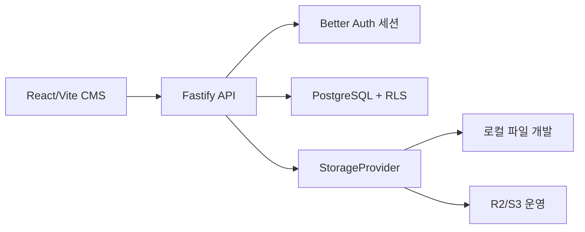

# 자체 호스팅 백엔드 결정과 구현 기준

> 결정일: 2026-08-02
> 상태: 기반 구현 중
> 범위: 범용 BaaS 복제가 아닌 웹사이트 빌더 전용 백엔드

## 결론

관리형 Supabase 런타임 대신 애플리케이션 전용 백엔드를 직접 소유합니다. PostgreSQL은 데이터와 RLS를, Fastify는 외부 API를, Better Auth는 비밀번호·세션 보안만 담당합니다. 브라우저는 DB 계정이나 SQL API를 받지 않고 `/api`에만 접근합니다.



직접 소유한다는 것은 인증 암호학까지 새로 발명한다는 뜻이 아닙니다. Better Auth는 저장소에 포함해 직접 배포하고, 사용자·워크스페이스·프로젝트·콘텐츠·미디어·공개·결제 규칙은 이 프로젝트의 API와 SQL이 소유합니다.

## 구현된 기반

- `server/README.md`: 실행 진입점, 폴더 책임, 시작 순서와 운영 경계
- `server/auth/`: Better Auth 모델·전용 DB pool·세션 라우트
- `server/routes/`: live/ready 상태와 플랫폼 HTTP API
- `server/services/`, `server/db/platform-repository.js`: HTTP와 workspace/project 사용 사례·SQL 분리
- `server/runtime.js`: 시작 실패 정리와 `SIGINT`·`SIGTERM` graceful shutdown
- `server/config.js`: API runtime, migration, role provisioning 설정 계약 분리
- `server/db/with-actor.js`: 트랜잭션 시작 후 `app_runtime` 역할과 `app.user_id`를 로컬 범위로 주입
- `server/scripts/migrate.js`: 순서·SHA-256 체크섬을 검증하는 SQL migration 실행기
- `db/migrations/0000_*`: `app_runtime`, `app_auth_runtime`, `app_public`, `app_functions` 역할과 스키마
- `db/migrations/0001_*`: Better Auth 1.6.25 PostgreSQL 테이블
- `db/migrations/0002_*`: identity, workspace, project, RLS, 초안 revision, 불변 Release
- `POST /api/v1/bootstrap`: workspace·owner membership·첫 project·site document 원자 생성
- `GET /api/v1/projects`: 세션 사용자에게 RLS로 허용된 프로젝트만 조회

깨끗한 PostgreSQL 17에서 migration을 두 번 실행하고, 실제 Better Auth cookie로 두 사용자가 각자 만든 프로젝트만 조회하는 통합 테스트를 통과했습니다. unsafe 역할·역할 membership, 비활성 identity, 삭제된 workspace 접근을 거부하고 `app_runtime`이 `BYPASSRLS`가 아니며 public 테이블을 소유하지 않는 것도 확인했습니다. React 로그인 연결은 아직 끝나지 않았고 기존 CMS는 계속 Local 데모 인증, `localStorage`, IndexedDB를 사용합니다.

## 보안 경계

1. Better Auth 세션의 외부 사용자 ID를 `identity_users.auth_subject`에 매핑합니다.
2. API는 내부 UUID를 확인한 뒤 모든 사용자 쿼리를 하나의 DB 트랜잭션으로 실행합니다.
3. 트랜잭션 안에서만 `SET LOCAL ROLE app_runtime`과 `set_config('app.user_id', ..., true)`를 적용합니다.
4. 연결 풀의 다음 요청에는 사용자 문맥이 남지 않습니다.
5. `app_runtime`은 테이블 소유자도 `BYPASSRLS` 역할도 아니며, Better Auth 테이블은 별도 `app_auth_runtime` 계정만 접근합니다.
6. 쓰기는 권한 검사를 포함한 제한된 함수만 허용하고, 브라우저에는 DB 자격 증명을 제공하지 않습니다.
7. 공개 API는 `current_release_id`가 가리키는 불변 Release만 반환해야 하며 초안을 반환하면 안 됩니다.

서버는 시작 시 실제 연결 계정이 각각 `app_runtime`, `app_auth_runtime`인지와 `SUPERUSER`, `BYPASSRLS`, 상위 역할 membership이 없는지를 확인하고 다르면 즉시 종료합니다. 사용자별 API 응답에는 `private, no-store`를 적용하며, Better Auth에 전달하는 IP는 허용한 프록시를 거쳐 Fastify가 계산한 값으로 덮어씁니다. 외부 `Host`·forwarded 헤더는 Auth 기준 URL을 바꾸지 못합니다. Migration은 advisory lock으로 동시 실행을 직렬화합니다.

`app_functions`는 로그인할 수 없는 `BYPASSRLS` 함수 소유 역할입니다. 따라서 모든 `SECURITY DEFINER` 함수는 고정 `search_path`, 최소 인자, 명시적 역할 검사와 회귀 테스트를 가져야 합니다.

## 로컬 실행 목표 절차

아래 절차는 테스트용 PostgreSQL에서 검증한 로컬 구성 순서입니다.

```powershell
Copy-Item server/.env.runtime.example server/.env.runtime.local
Copy-Item server/.env.admin.example server/.env.admin.local
# 두 파일의 DB 비밀번호와 runtime 파일의 32자 이상 BETTER_AUTH_SECRET을 로컬 값으로 교체
npm run db:setup
npm run api:dev
```

다른 터미널에서 프런트엔드를 실행합니다.

```powershell
npm run dev
```

파괴적 DB 통합 테스트는 이름이 `_test`로 끝나는 전용 DB에서만 별도 허용 플래그와 함께 실행됩니다. 운영 또는 개발 데이터가 있는 DB URL을 사용하면 안 됩니다.

```powershell
$env:ALLOW_DESTRUCTIVE_DB_TESTS='1'
$env:TEST_DATABASE_URL='postgresql://postgres:<test-password>@127.0.0.1:5432/site_builder_test'
npm run test:backend:integration
```

운영에서는 `DATABASE_MIGRATION_URL`, `DATABASE_URL`, `AUTH_DATABASE_URL`을 각각 migration 관리자, 플랫폼 RLS runtime, 인증 테이블 runtime 계정으로 분리합니다. `db:provision`은 두 runtime URL에 포함된 비밀번호를 관리자 연결로 설정하며 비밀번호를 로그에 출력하지 않습니다. migration 권한이 있는 URL은 migration 작업에만 주입하고 API 프로세스에는 제공하지 않습니다.

## MVP 순서

- [x] Fastify·Better Auth·PostgreSQL 모듈형 모놀리스 기반
- [x] 공급자 중립 actor 문맥과 workspace/project SQL 계약
- [x] migration 체크섬과 API 단위 테스트
- [x] 깨끗한 PostgreSQL에서 migration·역할·RLS·실제 Auth cookie 통합 테스트
- [ ] 실제 회원가입·로그인·새로고침 세션·로그아웃 E2E
- [ ] CMS의 Local 저장을 ContentRepository 뒤로 격리
- [ ] 초안 저장·revision 409·owner 공개·롤백 API 연결
- [ ] 로컬 파일 StorageProvider와 원본·파생본·용량 제한
- [ ] R2/S3 어댑터와 백업·복원 검증
- [ ] 기본 공개 URL과 배포
- [ ] 도메인·DNS, PortOne/Toss 결제, 감사 로그·모니터링

## 배포 원칙

- 개발은 Windows/WSL의 PostgreSQL과 Node 프로세스로 실행할 수 있으며 Docker Desktop은 필수가 아닙니다.
- CI는 표준 PostgreSQL 서비스에서 migration과 RLS를 검증한 뒤 기존 Supabase 전용 테스트를 제거합니다.
- 첫 외부 고객 전에는 TLS, 이메일 검증·재설정, rate limit, DB/객체 백업과 두 번의 복원 리허설이 필요합니다.
- 미디어는 로컬 디스크를 개발용으로만 사용하고 운영은 R2/S3 호환 객체 저장소로 전환합니다.
- 결제 비밀키와 webhook 검증은 API 서버에만 두며 프런트 번들에 포함하지 않습니다.
